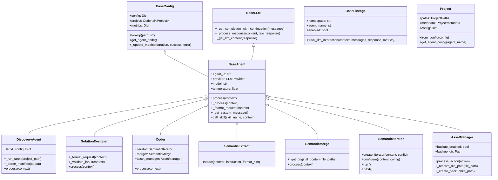

# c4h_agents API Reference

## Folder Structure

```
c4h_agents/
├── core/
│   └── project.py        # Project domain model
├── agents/
│   ├── base_agent.py     # Base implementation
│   ├── base_config.py    # Configuration management
│   ├── base_lineage.py   # Lineage tracking
│   ├── base_llm.py       # LLM interaction
│   ├── lineage_context.py # Context management
│   ├── discovery.py      # Project discovery
│   ├── solution_designer.py # Solution design
│   ├── coder.py          # Code modification
│   ├── assurance.py      # Validation agent
│   └── types.py          # Type definitions
├── skills/
│   ├── semantic_extract.py  # Information extraction
│   ├── semantic_merge.py    # Code merging
│   ├── semantic_iterator.py # Sequential processing
│   ├── semantic_formatter.py # Text formatting
│   ├── asset_manager.py     # File operations
│   ├── tartxt.py            # File analysis
│   ├── _semantic_fast.py    # Fast extraction
│   ├── _semantic_slow.py    # Sequential extraction
│   └── shared/
│       ├── types.py         # Shared type definitions
│       └── markdown_utils.py # Markdown processing
├── utils/
│   └── logging.py           # Logging utilities
└── config.py                # Configuration handling
```

## Class Diagram



## Core Classes and Functions

### 1. Project (core/project.py)

```python
class Project:
    # Initialization
    def __init__(self, paths: ProjectPaths, metadata: ProjectMetadata, config: Dict[str, Any])
    
    # Factory method
    @classmethod
    def from_config(cls, config: Dict[str, Any]) -> 'Project'
    
    # Configuration accessor
    def get_agent_config(self, agent_name: str) -> Dict[str, Any]
```

### 2. BaseAgent (agents/base_agent.py)

```python
class BaseAgent(BaseConfig, BaseLLM):
    # Initialization
    def __init__(self, config: Dict[str, Any] = None, project: Optional[Project] = None)
    
    # Main processing interface
    def process(self, context: Dict[str, Any]) -> AgentResponse
    
    # Internal processing
    def _process(self, context: Dict[str, Any]) -> AgentResponse
    def _get_data(self, context: Dict[str, Any]) -> Dict[str, Any]
    def _format_request(self, context: Dict[str, Any]) -> str
    def _get_llm_content(self, response: Any) -> Any
    def _process_response(self, content: str, raw_response: Any) -> Dict[str, Any]
    
    # Configuration methods
    def _get_required_keys(self) -> List[str]
    def _get_agent_name(self) -> str
    def _get_system_message(self) -> str
    def _get_prompt(self, prompt_type: str) -> str
    
    # Skill delegation
    def call_skill(self, skill_name: str, skill_context: Dict[str, Any]) -> Dict[str, Any]
```

### 3. DiscoveryAgent (agents/discovery.py)

```python
class DiscoveryAgent(BaseAgent):
    # Initialization
    def __init__(self, config: Dict[str, Any] = None)
    
    # Agent name for configuration
    def _get_agent_name(self) -> str
    
    # File processing
    def _parse_manifest(self, output: str) -> Dict[str, bool]
    def _resolve_input_paths(self, project_path: Path) -> List[str]
    def _run_tartxt(self, project_path: str) -> DiscoveryResult
    
    # Main processing
    def process(self, context: Dict[str, Any]) -> AgentResponse
```

### 4. SolutionDesigner (agents/solution_designer.py)

```python
class SolutionDesigner(BaseAgent):
    # Initialization
    def __init__(self, config: Dict[str, Any] = None)
    
    # Agent name for configuration
    def _get_agent_name(self) -> str
    
    # Request formatting
    def _format_request(self, context: Dict[str, Any]) -> str
    def _extract_context_data(self, context: Dict[str, Any]) -> Dict[str, Any]
    def _validate_input(self, context: Dict[str, Any]) -> bool
    
    # Main processing
    def process(self, context: Dict[str, Any]) -> AgentResponse
    def _process_llm_response(self, content: str, raw_response: Any) -> Dict[str, Any]
    def _get_data(self, context: Dict[str, Any]) -> Dict[str, Any]
```

### 5. Coder (agents/coder.py)

```python
class Coder(BaseAgent):
    # Initialization
    def __init__(self, config: Dict[str, Any] = None)
    
    # Main processing
    def process(self, context: Dict[str, Any]) -> AgentResponse
```

### 6. SemanticExtract (skills/semantic_extract.py)

```python
class SemanticExtract(BaseAgent):
    # Initialization
    def __init__(self, config: Dict[str, Any] = None)
    
    # Agent name for configuration
    def _get_agent_name(self) -> str
    
    # Request formatting
    def _format_request(self, context: Dict[str, Any]) -> str
    
    # Main extraction
    def extract(self, content: Any, instruction: str, format_hint: str = "default", **context: Any) -> ExtractResult
    
    # Response processing
    def _process_llm_response(self, content: str, raw_response: Any) -> Dict[str, Any]
```

### 7. SemanticMerge (skills/semantic_merge.py)

```python
class SemanticMerge(BaseAgent):
    # Initialization
    def __init__(self, config: Dict[str, Any] = None)
    
    # Agent name for configuration
    def _get_agent_name(self) -> str
    
    # Content handling
    def _get_original_content(self, file_path: str) -> Optional[str]
    def _format_request(self, context: Dict[str, Any]) -> str
    
    # Main processing
    def process(self, context: Dict[str, Any]) -> AgentResponse
    
    # Diff handling
    def _extract_content_from_diff(self, diff: str) -> Optional[str]
```

### 8. SemanticIterator (skills/semantic_iterator.py)

```python
class SemanticIterator(BaseAgent):
    # Initialization
    def __init__(self, config: Dict[str, Any] = None)
    
    # Agent name for configuration
    def _get_agent_name(self) -> str
    
    # Main processing
    def process(self, context: Dict[str, Any]) -> AgentResponse
    
    # Iterator protocol
    def __iter__(self) -> Iterator[Any]
    def __next__(self) -> Any
    
    # Legacy configuration
    def configure(self, content: Any, config: ExtractConfig) -> 'SemanticIterator'
```

### 9. AssetManager (skills/asset_manager.py)

```python
class AssetManager(BaseAgent):
    # Initialization
    def __init__(self, config: Dict[str, Any] = None, **kwargs)
    
    # Path resolution
    def _resolve_file_path(self, file_path: str) -> Path
    
    # Backup handling
    def _create_backup(self, file_path: Path) -> Optional[Path]
    
    # Action processing
    def process_action(self, action: Union[str, Dict[str, Any]]) -> AssetResult
    
    # Main processing
    def process(self, context: Dict[str, Any]) -> AgentResponse
```

## Configuration System

The configuration system uses a hierarchical structure with dot-notation paths for lookups. Configuration flows through the component hierarchy, with higher-level components passing configuration to lower-level ones.

### Configuration Hierarchy

```python
config = {
    "llm_config": {
        "providers": {
            "anthropic": {
                "api_base": "https://api.anthropic.com",
                "context_length": 200000,
                "env_var": "ANTHROPIC_API_KEY",
                "default_model": "claude-3-5-sonnet-20241022",
                "valid_models": [
                    "claude-3-7-sonnet-20250219",
                    "claude-3-5-sonnet-20241022",
                    "claude-3-5-haiku-20241022",
                    "claude-3-opus-20240229"
                ],
                "litellm_params": {
                    "retry": true,
                    "max_retries": 5,
                    "timeout": 30
                }
            },
            "openai": {
                "api_base": "https://api.openai.com/v1",
                "env_var": "OPENAI_API_KEY",
                "default_model": "gpt-4o"
            }
        },
        "default_provider": "anthropic",
        "default_model": "claude-3-opus-20240229",
        "agents": {
            "discovery": {
                "default_provider": "anthropic",
                "default_model": "claude-3-5-sonnet-20241022",
                "temperature": 0,
                "tartxt_config": {
                    "script_base_path": "c4h_agents/skills",
                    "input_paths": ["./"],
                    "exclusions": ["**/__pycache__/**"]
                }
            },
            "solution_designer": {
                "provider": "anthropic",
                "model": "claude-3-5-sonnet-20241022",
                "temperature": 0,
                "prompts": {
                    "system": "You are a code modification solution designer...",
                    "solution": "Source Code: {source_code}\n\nIntent: {intent}"
                }
            },
            "coder": {
                "provider": "anthropic",
                "model": "claude-3-opus-20240229",
                "temperature": 0
            }
        }
    },
    "project": {
        "path": "/path/to/project",
        "workspace_root": "workspaces"
    },
    "backup": {
        "enabled": true,
        "path": "workspaces/backups"
    },
    "logging": {
        "level": "INFO",
        "format": "structured",
        "agent_level": "INFO"
    }
}
```

### Configuration Access

```python
# Using direct path
value = config_node.get_value("llm_config.agents.discovery.temperature")

# Using agent-specific lookup
agent_config = locate_config(config, "discovery")

# Using ConfigNode for hierarchical access
config_node = create_config_node(config)
agent_node = config_node.get_node("llm_config.agents.discovery")
```

## Usage Patterns

### Complete Workflow

```python
# Initialize with configuration
config = {...}

# Initialize agents
discovery = DiscoveryAgent(config)
designer = SolutionDesigner(config)
coder = Coder(config)

# Execute discovery
discovery_result = discovery.process({
    "project_path": "/path/to/project"
})

# Design solution
solution_result = designer.process({
    "input_data": {
        "discovery_data": discovery_result.data,
        "intent": {
            "description": "Refactor code to follow single responsibility principle"
        }
    }
})

# Implement changes
coder_result = coder.process({
    "input_data": solution_result.data
})

# Access results
changes = coder_result.data.get("changes", [])
```

### Using Skills Directly

```python
# Initialize skill
extractor = SemanticExtract(config)

# Extract information
result = extractor.extract(
    content="Complex text with embedded information", 
    instruction="Extract all function names and their parameters",
    format_hint="json"
)

# Process result
if result.success:
    print(result.value)
```

### Using SemanticIterator

```python
# Initialize iterator
iterator = SemanticIterator(config)

# Configure
extract_config = ExtractConfig(
    instruction="Extract each code change",
    format="json"
)

# Process content
iterator.process({
    'content': complex_content,
    'config': extract_config
})

# Iterate through results
for item in iterator:
    print(f"Processing: {item}")
```

### File Operations with AssetManager

```python
# Initialize asset manager
asset_manager = AssetManager(
    config=config,
    backup_enabled=True,
    backup_dir=Path("workspaces/backups")
)

# Process file action
result = asset_manager.process_action({
    "file_path": "src/module.py",
    "type": "modify",
    "diff": "--- a/src/module.py\n+++ b/src/module.py\n@@ -1,3 +1,4 @@..."
})

# Check result
if result.success:
    print(f"File updated: {result.path}")
    print(f"Backup created: {result.backup_path}")
```

## Response Formats

All agents return a standardized `AgentResponse`:

```python
AgentResponse(
    success=True,  # or False on error
    data={         # Result data specific to the agent
        "response": "...",
        "raw_output": "...",
        "timestamp": "2024-03-07T12:34:56.789Z"
    },
    error=None,    # Error message if success=False
    messages=LLMMessages(...),  # Complete messages including system prompt
    raw_output=Any,  # Complete output from LLM
    metrics={      # Performance metrics
        "token_usage": {
            "completion_tokens": 123,
            "prompt_tokens": 456,
            "total_tokens": 579
        }
    }
)
```

## Key Design Principles

1. **LLM-First Processing**: Offload logic and decision-making to the LLM.
2. **Minimal Agent Logic**: Keep agent code focused on infrastructure concerns.
3. **Single Responsibility**: Each agent has one clear, focused task.
4. **Clear Boundaries**: Agents don't process tasks that belong to other agents.
5. **Template Configuration**: Prompt text in config files, not in code.
6. **Hierarchical Configuration**: Config paths follow consistent patterns.
7. **Explicit Over Implicit**: Clear prompt templates with explicit placeholders.
8. **Logging Over Validation**: Focus on detailed logging for debugging.