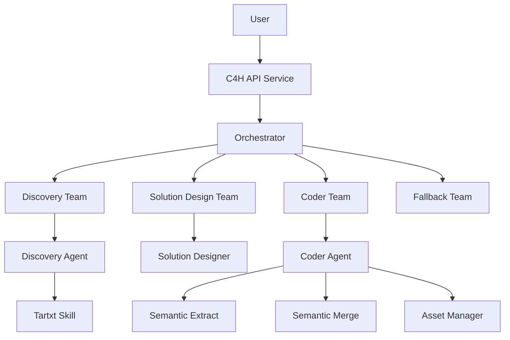
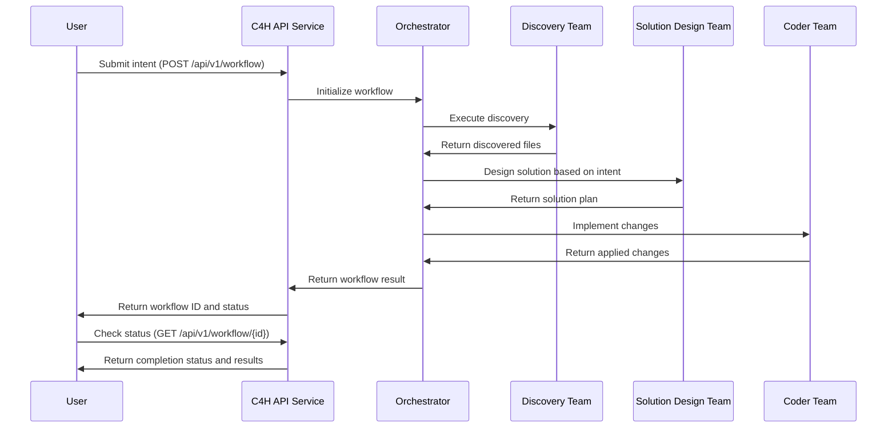

# C4H (Coder for Hire)

C4H is an intelligent code refactoring system that leverages Large Language Models (LLMs) to automate code modifications based on natural language intents. The system can analyze codebases, design optimal solutions, and implement changes while maintaining code quality and consistency.

## Architecture

C4H consists of two main components:

1. **c4h_agents**: Core library containing specialized agents for code analysis, solution design, and implementation.
2. **c4h_services**: Service layer providing workflow orchestration, API endpoints, and execution management.



## Workflow Sequence



## Installation

### Prerequisites

- Python 3.11 or higher
- pip (Python package installer)
- Virtual environment (recommended)

### Setup

1. Clone the repository:
   ```bash
   git clone https://github.com/yourusername/c4h.git
   cd c4h
   ```

2. Create and activate a virtual environment:
   ```bash
   python -m venv venv
   source venv/bin/activate  # On Windows: venv\Scripts\activate
   ```

3. Install c4h_agents:
   ```bash
   cd c4h_agents
   pip install -e ".[test]"
   cd ..
   ```

4. Install c4h_services:
   ```bash
   cd c4h_services
   pip install -e ".[test,prefect]"
   cd ..
   ```

5. Set up environment variables:
   ```bash
   # Create a .env file with your API keys
   echo "ANTHROPIC_API_KEY=your_key_here" > .env
   echo "OPENAI_API_KEY=your_key_here" >> .env
   ```

## Running Tests

### Setting Up Test Cases

1. Run the test setup script:
   ```bash
   python test/setup/setup_tests.py
   ```

2. This will create sample projects and test configurations in the `tests/examples` directory.

### Running Tests with Configuration

Use the provided test configuration to run a workflow:

```bash
python -m c4h_services.src.bootstrap.prefect_runner workflow \
    --config tests/examples/config/workflow_coder_01.yml
```

### Running in Different Modes

#### Workflow Mode (Direct Execution)

```bash
python -m c4h_services.src.bootstrap.prefect_runner workflow \
    --project-path /path/to/project \
    --intent-file intent.json
```

#### Service Mode (API Server)

Start the server:
```bash
python -m c4h_services.src.bootstrap.prefect_runner service \
    --port 8000 \
    --config config.yml
```

#### Client Mode (API Client)

```bash
python -m c4h_services.src.bootstrap.prefect_runner client \
    --host localhost \
    --port 8000 \
    --project-path /path/to/project \
    --intent-file intent.json \
    --poll
```

## Configuration

C4H uses a hierarchical YAML configuration for both system-level settings and intent-specific configurations:

```yaml
# Example minimal config.yml
project:
  path: "/path/to/project"
  workspace_root: "workspaces"

intent:
  description: "Add logging to all functions with proper error handling"

llm_config:
  default_provider: "anthropic"
  default_model: "claude-3-opus-20240229"
```

See `design_docs/SystemConfig_Design_Guide.md` for comprehensive configuration options.

## Design Principles

C4H follows several key design principles:

1. **LLM-First Processing**: Offload logic and decision-making to the LLM
2. **Minimal Agent Logic**: Keep agent code focused on infrastructure concerns
3. **Single Responsibility**: Each agent has one clear, focused task
4. **Forward-Only Flow**: Data flows forward through agent chain
5. **Configuration Hierarchy**: All configuration follows a strict hierarchy

Refer to `design_docs/Agent_Design_Principles_v2.md` and `design_docs/Config_Design_Principles.md` for detailed principles.


# C4H Services API Documentation

## Introduction

The C4H Services API provides a RESTful interface for submitting code refactoring requests and monitoring their progress. This document provides comprehensive details for integrating with the API, including endpoint definitions, request/response formats, and configuration options.

## API Overview

The API exposes three primary endpoints:

- `POST /api/v1/workflow` - Submit a new workflow request
- `GET /api/v1/workflow/{workflow_id}` - Check status of an existing workflow
- `GET /health` - Service health check

## Endpoints Reference

### Submit Workflow

```
POST /api/v1/workflow
```

This endpoint submits a new code refactoring request and initiates the workflow process.

#### Request Body

```json
{
  "project_path": "/path/to/project",
  "intent": {
    "description": "Description of your refactoring intent"
  },
  "app_config": {
    "key": "value"
  },
  "system_config": {
    "key": "value"
  }
}
```

| Field | Type | Required | Description |
|-------|------|----------|-------------|
| project_path | string | Yes | Path to the project directory |
| intent | object | Yes | Description of refactoring intent |
| app_config | object | No | Application-specific configuration |
| system_config | object | No | System-level configuration |

#### Response

```json
{
  "workflow_id": "wf_12345678-abcd-1234-efgh-123456789abc",
  "status": "pending",
  "storage_path": "workspaces/lineage/wf_12345678-abcd-1234-efgh-123456789abc",
  "error": null
}
```

| Field | Type | Description |
|-------|------|-------------|
| workflow_id | string | Unique identifier for the workflow |
| status | string | Current status of the workflow |
| storage_path | string | Path where workflow results are stored |
| error | string | Error message (null if no errors) |

Status values:
- `pending` - Processing in progress
- `success` - Completed successfully
- `error` - Failed (error field contains details)

### Check Workflow Status

```
GET /api/v1/workflow/{workflow_id}
```

This endpoint checks the status of an existing workflow.

#### URL Parameters

| Parameter | Type | Description |
|-----------|------|-------------|
| workflow_id | string | ID of the workflow to check |

#### Response

```json
{
  "workflow_id": "wf_12345678-abcd-1234-efgh-123456789abc",
  "status": "success",
  "storage_path": "workspaces/lineage/wf_12345678-abcd-1234-efgh-123456789abc",
  "error": null
}
```

The response format is identical to the workflow submission response.

### Health Check

```
GET /health
```

This endpoint verifies that the service is operational.

#### Response

```json
{
  "status": "healthy",
  "workflows_tracked": 5,
  "teams_available": 4
}
```

| Field | Type | Description |
|-------|------|-------------|
| status | string | Service status |
| workflows_tracked | integer | Number of workflows being tracked |
| teams_available | integer | Number of available agent teams |

## Configuration System

The C4H system uses a hierarchical configuration that determines how agents operate. When submitting a workflow, you can provide configuration at two levels:

1. **system_config**: Core system settings that affect all components
2. **app_config**: Application-specific settings that override system settings

These configurations are merged with the service's default configuration using a "smart merge" process that preserves the configuration hierarchy.

### Configuration Merging Process

When you submit a workflow request with custom configuration:

1. The base system configuration is loaded from the server
2. Your provided `system_config` is merged with the base configuration
3. Your provided `app_config` is merged on top, taking highest precedence
4. This merged configuration drives the agent behavior

The merge follows these principles:
- Base configuration provides the foundation
- Override configuration can add new nodes
- Override configuration can update leaf values
- Parent node structure is preserved during merges

### Core Configuration Sections

#### Project Settings

```yaml
project:
  path: "/path/to/project"  # Project root directory
  workspace_root: "workspaces"  # Directory for working files
  source_root: "src"  # Base directory for source code
  output_root: "output"  # Base directory for output files
  config_root: "config"  # Directory for configuration files
```

#### Intent Description

```yaml
intent:
  description: "Add logging to all functions with lineage tracking"
  target_files:  # Optional list of specific files to target
    - "src/services/auth.js"
    - "src/services/user.js"
```

#### LLM Configuration

```yaml
llm_config:
  # Provider settings
  providers:
    anthropic:
      api_base: "https://api.anthropic.com"
      context_length: 200000
      env_var: "ANTHROPIC_API_KEY"
      default_model: "claude-3-5-sonnet-20241022"
      valid_models:
        - "claude-3-7-sonnet-20250219"
        - "claude-3-5-sonnet-20241022"
      extended_thinking:
        enabled: false
        budget_tokens: 32000
    
    openai:
      api_base: "https://api.openai.com/v1"
      env_var: "OPENAI_API_KEY"
      default_model: "gpt-4o"
      valid_models:
        - "gpt-4o"
        - "gpt-4o-mini"
  
  # Global defaults
  default_provider: "anthropic"
  default_model: "claude-3-opus-20240229"
  
  # Agent-specific configurations
  agents:
    discovery:
      default_provider: "anthropic"
      default_model: "claude-3-5-sonnet-20241022" 
      temperature: 0
      tartxt_config:
        script_base_path: "c4h_agents/skills"
        input_paths: ["./"]
        exclusions: ["**/__pycache__/**"]
    
    solution_designer:
      provider: "anthropic"
      model: "claude-3-5-sonnet-20241022"
      temperature: 0
    
    coder:
      provider: "anthropic"
      model: "claude-3-opus-20240229"
      temperature: 0
```

#### Orchestration Settings

```yaml
orchestration:
  enabled: true
  entry_team: "discovery"  # First team to execute
  error_handling:
    retry_teams: true
    max_retries: 2
  teams:
    # Discovery team - analyzes project structure
    discovery:
      name: "Discovery Team"
      tasks:
        - name: "discovery"
          agent_class: "c4h_agents.agents.discovery.DiscoveryAgent"
          requires_approval: false
          max_retries: 2
      routing:
        default: "solution"  # Go to solution team next
    
    # Solution team - designs code changes
    solution:
      name: "Solution Design Team"
      tasks:
        - name: "solution_designer"
          agent_class: "c4h_agents.agents.solution_designer.SolutionDesigner"
          requires_approval: true
          max_retries: 1
      routing:
        rules:
          - condition: "all_success"
            next_team: "coder"
          - condition: "any_failure"
            next_team: "fallback"
    
    # Coder team - implements code changes
    coder:
      name: "Coder Team"
      tasks:
        - name: "coder"
          agent_class: "c4h_agents.agents.coder.Coder"
          requires_approval: true
          max_retries: 1
      routing:
        rules:
          - condition: "all_success"
            next_team: null  # End workflow
```

#### Runtime Configuration

```yaml
runtime:
  workflow:
    storage:
      enabled: true
      root_dir: "workspaces/workflows"
      format: "yymmdd_hhmm_{workflow_id}"
      retention:
        max_runs: 10
        max_days: 30
  lineage:
    enabled: true
    namespace: "c4h_agents"
    backend:
      type: "file"  
      path: "workspaces/lineage"
```

#### Logging Configuration

```yaml
logging:
  level: "INFO"
  format: "structured"
  agent_level: "INFO"
```

## Client Implementation Examples

### Python Client Example

```python
import requests
import time
import os.path

class C4HClient:
    def __init__(self, base_url="http://localhost:8000"):
        self.base_url = base_url
        
    def submit_workflow(self, project_path, intent_description, config=None):
        """Submit a new workflow request"""
        url = f"{self.base_url}/api/v1/workflow"
        
        # Normalize project path
        project_path = os.path.abspath(project_path)
        
        payload = {
            "project_path": project_path,
            "intent": {
                "description": intent_description
            }
        }
        
        if config:
            payload["app_config"] = config
            
        response = requests.post(url, json=payload)
        response.raise_for_status()
        return response.json()
    
    def get_workflow_status(self, workflow_id):
        """Get status of a workflow"""
        url = f"{self.base_url}/api/v1/workflow/{workflow_id}"
        response = requests.get(url)
        response.raise_for_status()
        return response.json()
    
    def wait_for_completion(self, workflow_id, interval=5, timeout=300, callback=None):
        """Wait for workflow completion with polling"""
        start_time = time.time()
        while time.time() - start_time < timeout:
            status = self.get_workflow_status(workflow_id)
            
            # Call the callback if provided
            if callback:
                callback(status)
                
            if status["status"] in ["success", "error"]:
                return status
                
            time.sleep(interval)
            
        raise TimeoutError(f"Workflow did not complete within {timeout} seconds")
    
    def check_health(self):
        """Check service health"""
        url = f"{self.base_url}/health"
        response = requests.get(url)
        response.raise_for_status()
        return response.json()
```

### Usage Example

```python
client = C4HClient("http://localhost:8000")

# Check service health
health = client.check_health()
print(f"Service status: {health['status']}")

# Submit a workflow
workflow = client.submit_workflow(
    project_path="/path/to/my_project",
    intent_description="Add proper error handling to all API endpoints"
)

workflow_id = workflow["workflow_id"]
print(f"Workflow submitted with ID: {workflow_id}")

# Poll for completion
def status_callback(status):
    print(f"Current status: {status['status']}")

result = client.wait_for_completion(
    workflow_id=workflow_id,
    interval=10,
    timeout=600,
    callback=status_callback
)

if result["status"] == "success":
    print("Workflow completed successfully!")
    print(f"Results stored at: {result['storage_path']}")
else:
    print(f"Workflow failed: {result['error']}")
```

### JavaScript Client Example

```javascript
class C4HClient {
  constructor(baseUrl = 'http://localhost:8000') {
    this.baseUrl = baseUrl;
  }
  
  async submitWorkflow(projectPath, intentDescription, config = null) {
    const url = `${this.baseUrl}/api/v1/workflow`;
    
    // Create payload
    const payload = {
      project_path: projectPath,
      intent: {
        description: intentDescription
      }
    };
    
    if (config) {
      payload.app_config = config;
    }
    
    // Send request
    const response = await fetch(url, {
      method: 'POST',
      headers: {
        'Content-Type': 'application/json'
      },
      body: JSON.stringify(payload)
    });
    
    if (!response.ok) {
      throw new Error(`API error: ${response.status} ${response.statusText}`);
    }
    
    return response.json();
  }
  
  async getWorkflowStatus(workflowId) {
    const url = `${this.baseUrl}/api/v1/workflow/${workflowId}`;
    
    const response = await fetch(url);
    
    if (!response.ok) {
      throw new Error(`API error: ${response.status} ${response.statusText}`);
    }
    
    return response.json();
  }
  
  async waitForCompletion(workflowId, interval = 5000, timeout = 300000, callback = null) {
    const startTime = Date.now();
    
    while (Date.now() - startTime < timeout) {
      const status = await this.getWorkflowStatus(workflowId);
      
      if (callback) {
        callback(status);
      }
      
      if (status.status === 'success' || status.status === 'error') {
        return status;
      }
      
      // Wait for next interval
      await new Promise(resolve => setTimeout(resolve, interval));
    }
    
    throw new Error(`Workflow did not complete within ${timeout/1000} seconds`);
  }
  
  async checkHealth() {
    const url = `${this.baseUrl}/health`;
    
    const response = await fetch(url);
    
    if (!response.ok) {
      throw new Error(`API error: ${response.status} ${response.statusText}`);
    }
    
    return response.json();
  }
}
```

## Common Use Cases

### Adding Logging

```json
{
  "project_path": "./my_project",
  "intent": {
    "description": "Add logging to all functions with proper error handling and level-appropriate log messages"
  }
}
```

### Implementing Design Patterns

```json
{
  "project_path": "./my_project",
  "intent": {
    "description": "Refactor to use the Factory pattern for class creation in the user module"
  }
}
```

### Performance Optimization with Custom Configuration

```json
{
  "project_path": "./my_project",
  "intent": {
    "description": "Optimize database queries in the data_access.py file to reduce execution time"
  },
  "app_config": {
    "llm_config": {
      "agents": {
        "coder": {
          "provider": "anthropic",
          "model": "claude-3-7-sonnet-20250219",
          "temperature": 0
        }
      }
    }
  }
}
```

## Error Handling

Common errors and their solutions:

| Error | Possible Cause | Solution |
|-------|----------------|----------|
| "No input paths configured" | Missing tartxt_config.input_paths | Ensure discovery agent has tartxt_config with input_paths |
| "Team not found" | Invalid entry_team | Verify orchestration.entry_team matches available teams |
| "No project path specified" | Missing project path | Provide valid project_path in request |
| "Invalid configuration" | Malformed config | Check configuration structure against schema |
| "Missing agent_class" | Incorrect task configuration | Ensure all tasks have valid agent_class defined |

## Security Considerations

- The service operates on the filesystem, ensure proper isolation
- Consider running in a container or restricted environment
- Validate project paths to prevent path traversal attacks
- Implement authentication for multi-user environments
- Use dotenv files for API keys instead of embedding in configuration

## License

[Your License Here]