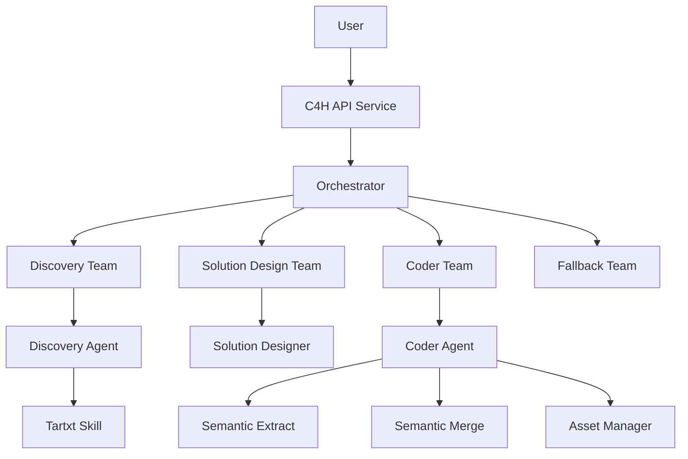
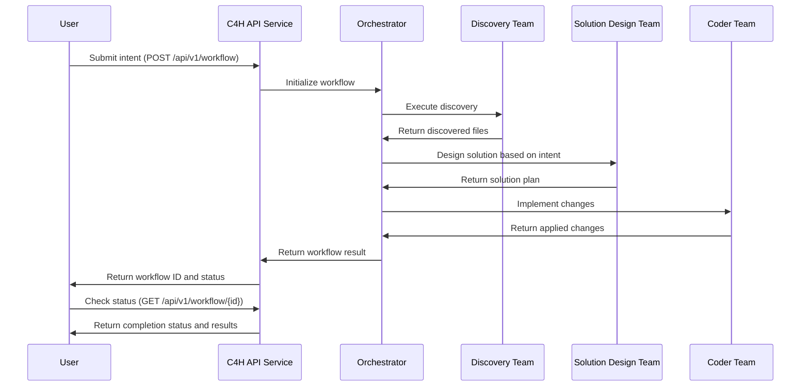

# C4H (Coder for Hire)

C4H is an intelligent code refactoring system that leverages Large Language Models (LLMs) to automate code modifications based on natural language intents. The system can analyze codebases, design optimal solutions, and implement changes while maintaining code quality and consistency.

## Architecture

C4H consists of two main components:

1. **c4h_agents**: Core library containing specialized agents for code analysis, solution design, and implementation.
2. **c4h_services**: Service layer providing workflow orchestration, API endpoints, and execution management.



## Workflow Sequence



## Installation

### Prerequisites

- Python 3.11 or higher
- pip (Python package installer)
- Virtual environment (recommended)

### Setup

1. Clone the repository:
   ```bash
   git clone https://github.com/yourusername/c4h.git
   cd c4h
   ```

2. Create and activate a virtual environment:
   ```bash
   python -m venv venv
   source venv/bin/activate  # On Windows: venv\Scripts\activate
   ```

3. Install c4h_agents:
   ```bash
   cd c4h_agents
   pip install -e ".[test]"
   cd ..
   ```

4. Install c4h_services:
   ```bash
   cd c4h_services
   pip install -e ".[test,prefect]"
   cd ..
   ```

5. Set up environment variables:
   ```bash
   # Create a .env file with your API keys
   echo "ANTHROPIC_API_KEY=your_key_here" > .env
   echo "OPENAI_API_KEY=your_key_here" >> .env
   ```

## Running Tests

### Setting Up Test Cases

1. Run the test setup script:
   ```bash
   python test/setup/setup_tests.py
   ```

2. This will create sample projects and test configurations in the `tests/examples` directory.

### Running Tests with Configuration

Use the provided test configuration to run a workflow:

```bash
python -m c4h_services.src.bootstrap.prefect_runner workflow \
    --config tests/examples/config/workflow_coder_01.yml
```

### Running in Different Modes

#### Workflow Mode (Direct Execution)

```bash
python -m c4h_services.src.bootstrap.prefect_runner workflow \
    --project-path /path/to/project \
    --intent-file intent.json
```

#### Service Mode (API Server)

Start the server:
```bash
python -m c4h_services.src.bootstrap.prefect_runner service \
    --port 8000 \
    --config config.yml
```

#### Client Mode (API Client)

```bash
python -m c4h_services.src.bootstrap.prefect_runner client \
    --host localhost \
    --port 8000 \
    --project-path /path/to/project \
    --intent-file intent.json \
    --poll
```

## Configuration

C4H uses a hierarchical YAML configuration for both system-level settings and intent-specific configurations:

```yaml
# Example minimal config.yml
project:
  path: "/path/to/project"
  workspace_root: "workspaces"

intent:
  description: "Add logging to all functions with proper error handling"

llm_config:
  default_provider: "anthropic"
  default_model: "claude-3-opus-20240229"
```

See `design_docs/SystemConfig_Design_Guide.md` for comprehensive configuration options.

## Design Principles

C4H follows several key design principles:

1. **LLM-First Processing**: Offload logic and decision-making to the LLM
2. **Minimal Agent Logic**: Keep agent code focused on infrastructure concerns
3. **Single Responsibility**: Each agent has one clear, focused task
4. **Forward-Only Flow**: Data flows forward through agent chain
5. **Configuration Hierarchy**: All configuration follows a strict hierarchy

Refer to `design_docs/Agent_Design_Principles_v2.md` and `design_docs/Config_Design_Principles.md` for detailed principles.

## License

[Your License Here]