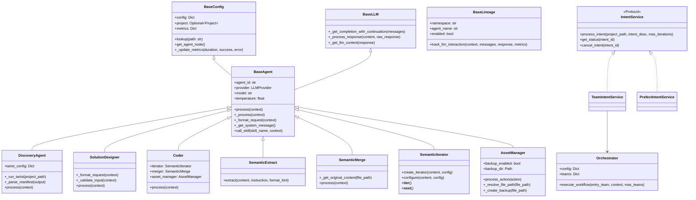

# C4H Services API Integration Guide

## Introduction

This guide provides comprehensive details for integrating with the C4H Services API, a system designed for orchestrating intelligent code refactoring workflows. The API allows you to submit code refactoring intents and receive structured results, making it ideal for building GUI interfaces for code analysis and transformation.

## Folder Structure

```
c4h_agents/
├── core/
│   └── project.py        # Project domain model
├── agents/
│   ├── base_agent.py     # Base implementation
│   ├── base_config.py    # Configuration management
│   ├── base_lineage.py   # Lineage tracking
│   ├── base_llm.py       # LLM interaction
│   ├── lineage_context.py # Context management
│   ├── discovery.py      # Project discovery
│   ├── solution_designer.py # Solution design
│   ├── coder.py          # Code modification
│   ├── assurance.py      # Validation agent
│   └── types.py          # Type definitions
├── skills/
│   ├── semantic_extract.py  # Information extraction
│   ├── semantic_merge.py    # Code merging
│   ├── semantic_iterator.py # Sequential processing
│   ├── semantic_formatter.py # Text formatting
│   ├── asset_manager.py     # File operations
│   ├── tartxt.py            # File analysis
│   ├── _semantic_fast.py    # Fast extraction
│   ├── _semantic_slow.py    # Sequential extraction
│   └── shared/
│       ├── types.py         # Shared type definitions
│       └── markdown_utils.py # Markdown processing
├── utils/
│   └── logging.py           # Logging utilities
└── config.py                # Configuration handling

c4h_services/
├── src/
│   ├── bootstrap/
│   │   └── prefect_runner.py    # Main entry point
│   ├── api/
│   │   ├── service.py           # FastAPI service
│   │   └── models.py            # API models
│   ├── intent/
│   │   ├── core/
│   │   │   └── service.py       # Service interface
│   │   └── impl/
│   │       ├── team/
│   │       │   └── service.py   # Team implementation
│   │       └── prefect/
│   │           ├── service.py   # Prefect implementation
│   │           ├── flows.py     # Workflow definitions
│   │           ├── tasks.py     # Task wrappers
│   │           ├── models.py    # Task models
│   │           ├── factories.py # Task factories
│   │           └── workflows.py # Workflow logic
│   ├── orchestration/
│   │   ├── orchestrator.py      # Team orchestration
│   │   └── team.py              # Team implementation
│   └── utils/
│       ├── logging.py           # Logging utilities
│       └── string_utils.py      # String utilities
```

## Class Diagram



## API Overview

The C4H Services exposes a RESTful API for managing workflow executions. The primary endpoints are:

- `POST /api/v1/workflow` - Submit a new workflow request
- `GET /api/v1/workflow/{workflow_id}` - Check status of an existing workflow
- `GET /health` - Service health check

## Core Concepts

### Workflow

A workflow represents an end-to-end execution process that typically includes:

1. **Discovery** - Analysis of the project structure and files
2. **Solution Design** - Planning modifications based on intent
3. **Code Implementation** - Applying the planned changes

### Intent

An "intent" specifies what you want to accomplish with the codebase. Examples include:
- Adding error handling
- Improving logging
- Refactoring for performance
- Applying design patterns

### Teams

The system uses a team-based approach where specialized agent teams handle different aspects of the workflow:
- **Discovery Team** - Analyzes project files and structure
- **Solution Team** - Designs changes based on intent
- **Coder Team** - Implements the designed changes
- **Fallback Team** - Handles failures with a simplified approach

## API Reference

### Submit Workflow

```
POST /api/v1/workflow
```

#### Request Body

```json
{
  "project_path": "/path/to/project",
  "intent": {
    "description": "Description of your refactoring intent"
  },
  "app_config": {
    "key": "value"
  },
  "system_config": {
    "key": "value"
  }
}
```

| Field | Type | Required | Description |
|-------|------|----------|-------------|
| project_path | string | Yes | Path to the project directory |
| intent | object | Yes | Description of refactoring intent |
| app_config | object | No | Application-specific configuration |
| system_config | object | No | System-level configuration |

#### Response

```json
{
  "workflow_id": "wf_12345678-abcd-1234-efgh-123456789abc",
  "status": "pending",
  "storage_path": "workspaces/lineage/wf_12345678-abcd-1234-efgh-123456789abc",
  "error": null
}
```

| Field | Type | Description |
|-------|------|-------------|
| workflow_id | string | Unique identifier for the workflow |
| status | string | Current status of the workflow |
| storage_path | string | Path where workflow results are stored |
| error | string | Error message (null if no errors) |

Status values:
- `pending` - Processing in progress
- `success` - Completed successfully
- `error` - Failed (error field contains details)

### Check Workflow Status

```
GET /api/v1/workflow/{workflow_id}
```

#### URL Parameters

| Parameter | Type | Description |
|-----------|------|-------------|
| workflow_id | string | ID of the workflow to check |

#### Response

```json
{
  "workflow_id": "wf_12345678-abcd-1234-efgh-123456789abc",
  "status": "success",
  "storage_path": "workspaces/lineage/wf_12345678-abcd-1234-efgh-123456789abc",
  "error": null
}
```

### Health Check

```
GET /health
```

#### Response

```json
{
  "status": "healthy",
  "workflows_tracked": 5,
  "teams_available": 4
}
```

## Configuration System

The system uses a hierarchical configuration structure. When submitting a workflow, you can provide configuration at two levels:

1. **system_config**: Core system settings that affect all components
2. **app_config**: Application-specific settings that override system settings

### Configuration Merging Process

When you submit a workflow request with custom configuration:

1. The base system configuration is loaded from the server
2. Your provided `system_config` is merged with the base configuration
3. Your provided `app_config` is merged on top, taking highest precedence
4. This merged configuration drives the agent behavior

The merge follows these principles:
- Base configuration provides the foundation
- Override configuration can add new nodes
- Override configuration can update leaf values
- Parent node structure is preserved during merges

### Configuration Structure

Here's a comprehensive example of the configuration structure:

```yaml
# Project settings
project:
  path: "/path/to/project"
  workspace_root: "workspaces"
  source_root: "src"
  output_root: "output"
  config_root: "config"

# Intent description
intent:
  description: "Add logging to all functions with lineage tracking"
  target_files:
    - "src/services/auth.js"
    - "src/services/user.js"

# LLM Configuration
llm_config:
  # Provider settings
  providers:
    anthropic:
      api_base: "https://api.anthropic.com"
      context_length: 200000
      env_var: "ANTHROPIC_API_KEY"
      default_model: "claude-3-5-sonnet-20241022"
      valid_models:
        - "claude-3-7-sonnet-20250219"
        - "claude-3-5-sonnet-20241022"
        - "claude-3-5-haiku-20241022"
        - "claude-3-opus-20240229"
        - "claude-3-sonnet-20240229"
        - "claude-3-haiku-20240307"
      extended_thinking:
        enabled: false
        budget_tokens: 32000
        min_budget_tokens: 1024
        max_budget_tokens: 128000        
      litellm_params:
        retry: true
        max_retries: 5
        timeout: 30
        rate_limit_policy:
          tokens: 8000
          requests: 50
          period: 60
        backoff:
          initial_delay: 1
          max_delay: 30
          exponential: true
    
    openai:
      api_base: "https://api.openai.com/v1"
      env_var: "OPENAI_API_KEY"
      default_model: "gpt-4o"
      valid_models:
        - "gpt-4o"
        - "gpt-4o-mini"
        - "gpt-4"
        - "gpt-4-turbo"
        - "o1"
        - "o1-mini"
        - "o3-mini"
      litellm_params:
        retry: true
        max_retries: 3
        timeout: 30
        rate_limit_policy:
          tokens: 4000
          requests: 200
          period: 60
        backoff:
          initial_delay: 1
          max_delay: 20
          exponential: true
          
    gemini:
      api_base: "https://generativelanguage.googleapis.com/v1beta"
      context_length: 32000
      env_var: "GEMINI_API_KEY"
      default_model: "gemini-2"
      valid_models:
        - "gemini-1"
        - "gemini-1.5"
        - "gemini-2"
  
  # Global defaults
  default_provider: "anthropic"
  default_model: "claude-3-opus-20240229"
  
  # Agent-specific configurations
  agents:
    discovery:
      default_provider: "anthropic"
      default_model: "claude-3-5-sonnet-20241022" 
      temperature: 0
      tartxt_config:
        script_base_path: "c4h_agents/skills"
        input_paths: ["./"]
        exclusions: ["**/__pycache__/**"]
    
    solution_designer:
      provider: "anthropic"
      model: "claude-3-5-sonnet-20241022"
      temperature: 0
    
    coder:
      provider: "anthropic"
      model: "claude-3-opus-20240229"
      temperature: 0

# Orchestration settings
orchestration:
  enabled: true
  entry_team: "discovery"  # First team to execute
  error_handling:
    retry_teams: true
    max_retries: 2
    log_level: "ERROR"
  teams:
    # Discovery team - analyzes project structure
    discovery:
      name: "Discovery Team"
      tasks:
        - name: "discovery"
          agent_class: "c4h_agents.agents.discovery.DiscoveryAgent"
          requires_approval: false
          max_retries: 2
      routing:
        default: "solution"  # Go to solution team next
    
    # Solution team - designs code changes
    solution:
      name: "Solution Design Team"
      tasks:
        - name: "solution_designer"
          agent_class: "c4h_agents.agents.solution_designer.SolutionDesigner"
          requires_approval: true
          max_retries: 1
      routing:
        rules:
          - condition: "all_success"
            next_team: "coder"
          - condition: "any_failure"
            next_team: "fallback"
        default: "coder"  # Default next team
    
    # Coder team - implements code changes
    coder:
      name: "Coder Team"
      tasks:
        - name: "coder"
          agent_class: "c4h_agents.agents.coder.Coder"
          requires_approval: true
          max_retries: 1
      routing:
        rules:
          - condition: "all_success"
            next_team: null  # End workflow on success
        default: null  # End workflow by default
    
    # Fallback team - handles failures with simplified approach
    fallback:
      name: "Fallback Team"
      tasks:
        - name: "fallback_coder"
          agent_class: "c4h_agents.agents.coder.Coder"
          config:
            temperature: 0  # Lower temperature for more conservative changes
      routing:
        default: null  # End workflow after fallback

# Runtime configuration
runtime:
  # Workflow storage configuration
  workflow:
    storage:
      enabled: true
      root_dir: "workspaces/workflows"
      format: "yymmdd_hhmm_{workflow_id}"
      retention:
        max_runs: 10
        max_days: 30
      error_handling:
        ignore_storage_errors: true
        log_level: "ERROR"
  # Lineage tracking configuration
  lineage:
    enabled: true
    namespace: "c4h_agents"
    separate_input_output: true
    backend:
      type: "file"  # File-based storage is more reliable for initial testing
      path: "workspaces/lineage"  # Use explicit relative path
    error_handling:
      ignore_failures: true  # Don't let lineage errors affect workflow
      log_level: "ERROR"
    context:
      include_metrics: true
      include_token_usage: true
      record_timestamps: true
    retry:
      enabled: true
      max_attempts: 3
      initial_delay: 1
      max_delay: 30
      backoff_factor: 2
      retry_on:
        - "overloaded_error"
        - "rate_limit_error"
        - "timeout_error"

# Backup settings
backup:
  enabled: true
  path: "workspaces/backups"

# Logging configuration
logging:
  level: "INFO"
  format: "structured"
  agent_level: "INFO"
  providers:
    anthropic:
      level: "debug"
    openai:
      level: "debug"
  truncate:
    prefix_length: 30
    suffix_length: 30
```

## Client Implementation Examples

### Python Client Example

```python
import requests
import time
import os.path

class C4HClient:
    def __init__(self, base_url="http://localhost:8000"):
        self.base_url = base_url
        
    def submit_workflow(self, project_path, intent_description, config=None):
        """Submit a new workflow request"""
        url = f"{self.base_url}/api/v1/workflow"
        
        # Normalize project path
        project_path = os.path.abspath(project_path)
        
        payload = {
            "project_path": project_path,
            "intent": {
                "description": intent_description
            }
        }
        
        if config:
            payload["app_config"] = config
            
        response = requests.post(url, json=payload)
        response.raise_for_status()
        return response.json()
    
    def get_workflow_status(self, workflow_id):
        """Get status of a workflow"""
        url = f"{self.base_url}/api/v1/workflow/{workflow_id}"
        response = requests.get(url)
        response.raise_for_status()
        return response.json()
    
    def wait_for_completion(self, workflow_id, interval=5, timeout=300, callback=None):
        """Wait for workflow completion with polling"""
        start_time = time.time()
        while time.time() - start_time < timeout:
            status = self.get_workflow_status(workflow_id)
            
            # Call the callback if provided
            if callback:
                callback(status)
                
            if status["status"] in ["success", "error"]:
                return status
                
            time.sleep(interval)
            
        raise TimeoutError(f"Workflow did not complete within {timeout} seconds")
    
    def check_health(self):
        """Check service health"""
        url = f"{self.base_url}/health"
        response = requests.get(url)
        response.raise_for_status()
        return response.json()
```

### JavaScript Client Example

```javascript
class C4HClient {
  constructor(baseUrl = 'http://localhost:8000') {
    this.baseUrl = baseUrl;
  }
  
  async submitWorkflow(projectPath, intentDescription, config = null) {
    const url = `${this.baseUrl}/api/v1/workflow`;
    
    // Create payload
    const payload = {
      project_path: projectPath,
      intent: {
        description: intentDescription
      }
    };
    
    if (config) {
      payload.app_config = config;
    }
    
    // Send request
    const response = await fetch(url, {
      method: 'POST',
      headers: {
        'Content-Type': 'application/json'
      },
      body: JSON.stringify(payload)
    });
    
    if (!response.ok) {
      throw new Error(`API error: ${response.status} ${response.statusText}`);
    }
    
    return response.json();
  }
  
  async getWorkflowStatus(workflowId) {
    const url = `${this.baseUrl}/api/v1/workflow/${workflowId}`;
    
    const response = await fetch(url);
    
    if (!response.ok) {
      throw new Error(`API error: ${response.status} ${response.statusText}`);
    }
    
    return response.json();
  }
  
  async waitForCompletion(workflowId, interval = 5000, timeout = 300000, callback = null) {
    const startTime = Date.now();
    
    while (Date.now() - startTime < timeout) {
      const status = await this.getWorkflowStatus(workflowId);
      
      if (callback) {
        callback(status);
      }
      
      if (status.status === 'success' || status.status === 'error') {
        return status;
      }
      
      // Wait for next interval
      await new Promise(resolve => setTimeout(resolve, interval));
    }
    
    throw new Error(`Workflow did not complete within ${timeout/1000} seconds`);
  }
  
  async checkHealth() {
    const url = `${this.baseUrl}/health`;
    
    const response = await fetch(url);
    
    if (!response.ok) {
      throw new Error(`API error: ${response.status} ${response.statusText}`);
    }
    
    return response.json();
  }
}
```

### Usage Example

```python
client = C4HClient("http://localhost:8000")

# Check service health
health = client.check_health()
print(f"Service status: {health['status']}")

# Submit a workflow
workflow = client.submit_workflow(
    project_path="/path/to/my_project",
    intent_description="Add proper error handling to all API endpoints"
)

workflow_id = workflow["workflow_id"]
print(f"Workflow submitted with ID: {workflow_id}")

# Poll for completion
def status_callback(status):
    print(f"Current status: {status['status']}")

result = client.wait_for_completion(
    workflow_id=workflow_id,
    interval=10,
    timeout=600,
    callback=status_callback
)

if result["status"] == "success":
    print("Workflow completed successfully!")
    print(f"Results stored at: {result['storage_path']}")
else:
    print(f"Workflow failed: {result['error']}")
```

## Project Model

The system uses a project model that includes:

### Project Paths
- `root` - Project root directory
- `workspace` - Directory for working files
- `source` - Source code directory
- `output` - Output directory for modifications
- `config` - Configuration files location

### Project Metadata
- `name` - Project name (derived from directory name)
- `description` - Optional project description
- `version` - Optional version information
- `settings` - Custom project settings

## Workflow Execution Flow

1. **Initialization**:
   - Client submits workflow request with project path and intent
   - Server generates a workflow ID
   - Server prepares configuration with default values

2. **Team Execution**:
   - Discovery team analyzes project structure using tartxt
   - Solution team designs code modifications
   - Coder team implements changes using semantic extraction and merging
   - If solution design fails, the fallback team handles using a more conservative approach

3. **Result Storage**:
   - Changes are written to the project files
   - Backup copies are created before modifications
   - Lineage information is recorded with execution paths
   - Status information is stored for retrieval

## Common Use Cases

### Adding Logging

```json
{
  "project_path": "./my_project",
  "intent": {
    "description": "Add logging to all functions with proper error handling and level-appropriate log messages"
  }
}
```

### Implementing Design Patterns

```json
{
  "project_path": "./my_project",
  "intent": {
    "description": "Refactor to use the Factory pattern for class creation in the user module"
  }
}
```

### Performance Optimization

```json
{
  "project_path": "./my_project",
  "intent": {
    "description": "Optimize database queries in the data_access.py file to reduce execution time"
  },
  "app_config": {
    "llm_config": {
      "agents": {
        "coder": {
          "provider": "anthropic",
          "model": "claude-3-7-sonnet-20250219",
          "temperature": 0
        }
      }
    }
  }
}
```

### Applying Agent Design Principles

```json
{
  "project_path": "./my_project",
  "intent": {
    "description": "Refactor the code to follow the agent design principles: LLM-first processing, minimal agent logic, clear boundaries, and forward-only flow"
  }
}
```

## Error Handling

Common errors and their solutions:

| Error | Possible Cause | Solution |
|-------|----------------|----------|
| "No input paths configured" | Missing tartxt_config.input_paths | Ensure discovery agent has tartxt_config with input_paths |
| "Team not found" | Invalid entry_team | Verify orchestration.entry_team matches available teams |
| "No project path specified" | Missing project path | Provide valid project_path in request |
| "Invalid configuration" | Malformed config | Check configuration structure against schema |
| "Missing agent_class" | Incorrect task configuration | Ensure all tasks have valid agent_class defined |

## Security Considerations

- The service operates on the filesystem, ensure proper isolation
- Consider running in a container or restricted environment
- Validate project paths to prevent path traversal attacks
- Implement authentication for multi-user environments
- Use dotenv files for API keys instead of embedding in configuration

## Implementation Considerations for GUI

When building a GUI application over this API, consider:

1. **Project Selection**:
   - Allow users to select/browse project directories
   - Validate project structure before submission
   - Show project stats (file count, languages, etc.)

2. **Intent Formulation**:
   - Provide templates for common intents
   - Allow custom intent descriptions
   - Offer guided intent creation through Q&A
   - Support target file/directory selection

3. **Configuration Management**:
   - Provide UI for editing hierarchical configuration
   - Group configuration by component
   - Offer sensible defaults
   - Include model selection with appropriate options

4. **Workflow Monitoring**:
   - Poll the status endpoint at reasonable intervals
   - Display execution progress with team transitions
   - Show live logs if available
   - Visualize execution path

5. **Result Visualization**:
   - Display diffs between original and modified files
   - Allow navigation through changed files
   - Provide options to accept/reject changes
   - Show backup locations