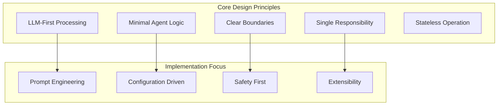
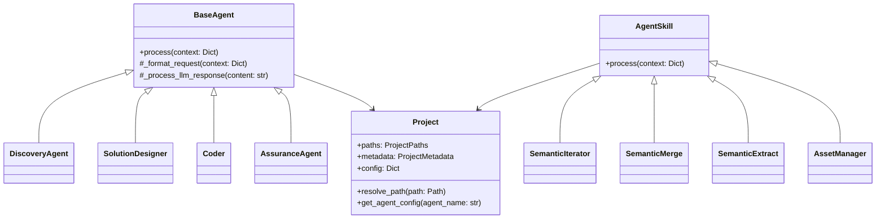
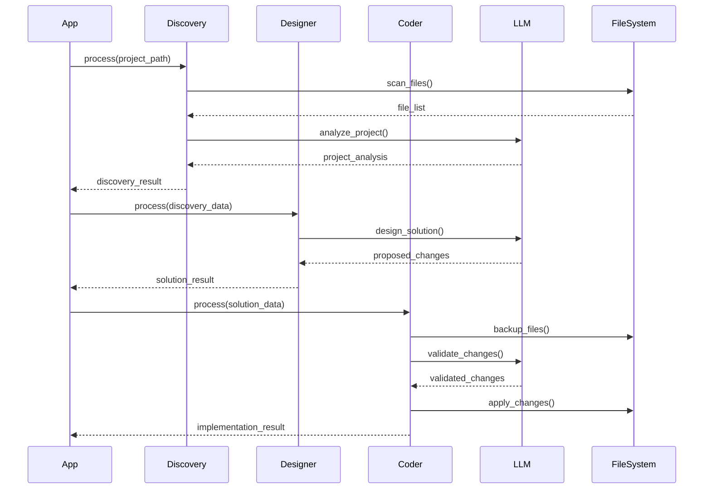

# C4H Agents Library Documentation

## Table of Contents

1. [Introduction](#introduction)
2. [Design Principles](#design-principles)
3. [Architecture Overview](#architecture-overview)
4. [Core Components](#core-components)
   - [Base Agent](#base-agent)
   - [Project Model](#project-model)
   - [Configuration System](#configuration-system)
5. [Agents](#agents)
   - [Discovery Agent](#discovery-agent)
   - [Solution Designer](#solution-designer)
   - [Coder Agent](#coder-agent)
   - [Assurance Agent](#assurance-agent)
6. [Skills](#skills)
   - [Semantic Iterator](#semantic-iterator)
   - [Semantic Merge](#semantic-merge)
   - [Semantic Extract](#semantic-extract)
   - [Asset Manager](#asset-manager)
7. [Use Cases](#use-cases)
   - [Prefect Runner Integration](#prefect-runner-integration)
   - [Standalone Usage](#standalone-usage)
8. [Configuration Guide](#configuration-guide)

## Introduction

The C4H Agents Library provides a collection of LLM-powered agents and skills designed for code refactoring and analysis tasks. Built with a focus on modularity and extensibility, it enables both standalone usage and integration into larger systems.

Key Features:
- Modular agent architecture
- Standardized interfaces
- Rich configuration system
- Project-aware operations
- LLM provider abstraction
- Built-in backup and safety features

## Design Principles



1. **LLM-First Processing**
   - Leverage LLM capabilities for complex tasks
   - Keep agent logic focused on orchestration
   - Use structured prompts for consistent outputs

2. **Minimal Agent Logic**
   - Agents focus on coordination and safety
   - Core processing delegated to LLM
   - Configuration drives behavior

3. **Clear Boundaries**
   - Well-defined interfaces
   - Explicit data contracts
   - Clear responsibility separation

4. **Single Responsibility**
   - Each agent has a specific focus
   - Skills provide reusable capabilities
   - Clear separation of concerns

5. **Stateless Operation**
   - No shared state between operations
   - Project context passed explicitly
   - Idempotent operations

## Architecture Overview



## Core Components

### Base Agent

The BaseAgent class provides core functionality for all agents:

```python
from typing import Dict, Any
from c4h_agents.agents.base import BaseAgent

class CustomAgent(BaseAgent):
    def _get_agent_name(self) -> str:
        return "custom_agent"
        
    def _format_request(self, context: Dict[str, Any]) -> str:
        # Format request for LLM
        return self._get_prompt('custom').format(**context)
        
    def process(self, context: Dict[str, Any]) -> AgentResponse:
        # Custom processing logic
        result = super().process(context)
        return result
```

### Configuration System

Configuration is hierarchical and merged from multiple sources:

```yaml
# system_config.yml
providers:
  anthropic:
    api_base: "https://api.anthropic.com"
    default_model: "claude-3-opus-20240229"

llm_config:
  agents:
    custom_agent:
      provider: "anthropic"
      model: "claude-3-opus-20240229"
      temperature: 0
      prompts:
        system: "System prompt template"
        custom: "Custom prompt template {variable}"
```

## Use Cases

### Prefect Runner Integration

Example of integrating with Prefect workflows:

```python
from prefect import flow
from c4h_agents.agents.discovery import DiscoveryAgent
from c4h_agents.agents.solution_designer import SolutionDesigner
from c4h_agents.agents.coder import Coder

@flow
def refactor_workflow(project_path: Path, config: Dict[str, Any]):
    # Discovery phase
    discovery = DiscoveryAgent(config=config)
    discovery_result = discovery.process({"project_path": project_path})
    
    # Solution design
    designer = SolutionDesigner(config=config)
    solution_result = designer.process({
        "discovery_data": discovery_result.data,
        "intent": config.get("intent", {})
    })
    
    # Implementation
    coder = Coder(config=config)
    return coder.process({"input_data": solution_result.data})
```

### Standalone Usage

Using agents directly:

```python
from pathlib import Path
from c4h_agents.config import load_config
from c4h_agents.agents.coder import Coder

# Load configuration
config = load_config("config/system_config.yml")

# Initialize agent
coder = Coder(config=config)

# Process changes
result = coder.process({
    "input_data": {
        "changes": [
            {
                "file_path": "sample.py",
                "type": "modify",
                "content": "def hello(): print('world')"
            }
        ]
    }
})

print(f"Success: {result.success}")
print(f"Changes: {result.data.get('changes', [])}")
```

## Skills Integration

Example using the semantic iterator:

```python
from c4h_agents.skills.semantic_iterator import SemanticIterator
from c4h_agents.skills.shared.types import ExtractConfig

iterator = SemanticIterator(config=config)

# Configure extraction
extract_config = ExtractConfig(
    instruction="Extract each function definition",
    format="json"
)

# Process content
for item in iterator.configure(content=code, config=extract_config):
    print(f"Extracted: {item}")
```

## Configuration Guide

Key configuration sections:

1. **Providers**: LLM provider settings
   ```yaml
   providers:
     anthropic:
       api_base: "https://api.anthropic.com"
       default_model: "claude-3-opus-20240229"
   ```

2. **Agent Configuration**: Per-agent settings
   ```yaml
   llm_config:
     agents:
       discovery:
         provider: "anthropic"
         temperature: 0
         prompts:
           system: "..."
   ```

3. **Project Settings**: Project-specific configuration
   ```yaml
   project:
     path: "/path/to/project"
     workspace_root: "workspaces"
   ```

4. **Backup Settings**: Safety configuration
   ```yaml
   backup:
     enabled: true
     path: "workspaces/backups"
   ```

## Best Practices

1. **Safety First**
   - Always enable backups
   - Use minimal permissions
   - Validate changes before applying

2. **Configuration Management**
   - Keep sensitive settings in environment
   - Use hierarchical config
   - Override only needed settings

3. **Error Handling**
   - Check agent response success
   - Log operations for debugging
   - Use proper fallbacks

4. **Integration Patterns**
   - Pass complete context
   - Use proper typing
   - Follow agent interfaces

## Sequence Diagram

Example workflow sequence:



This diagram shows a typical workflow interaction between components, demonstrating the separation of concerns and clear interfaces between agents.