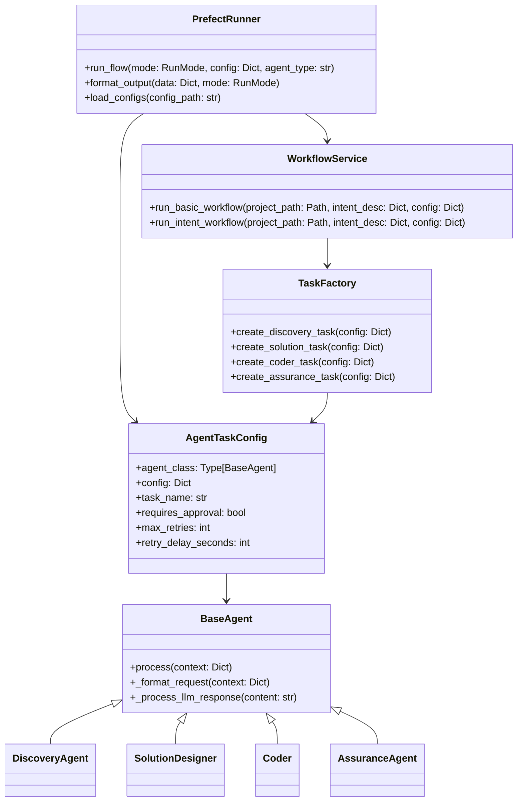
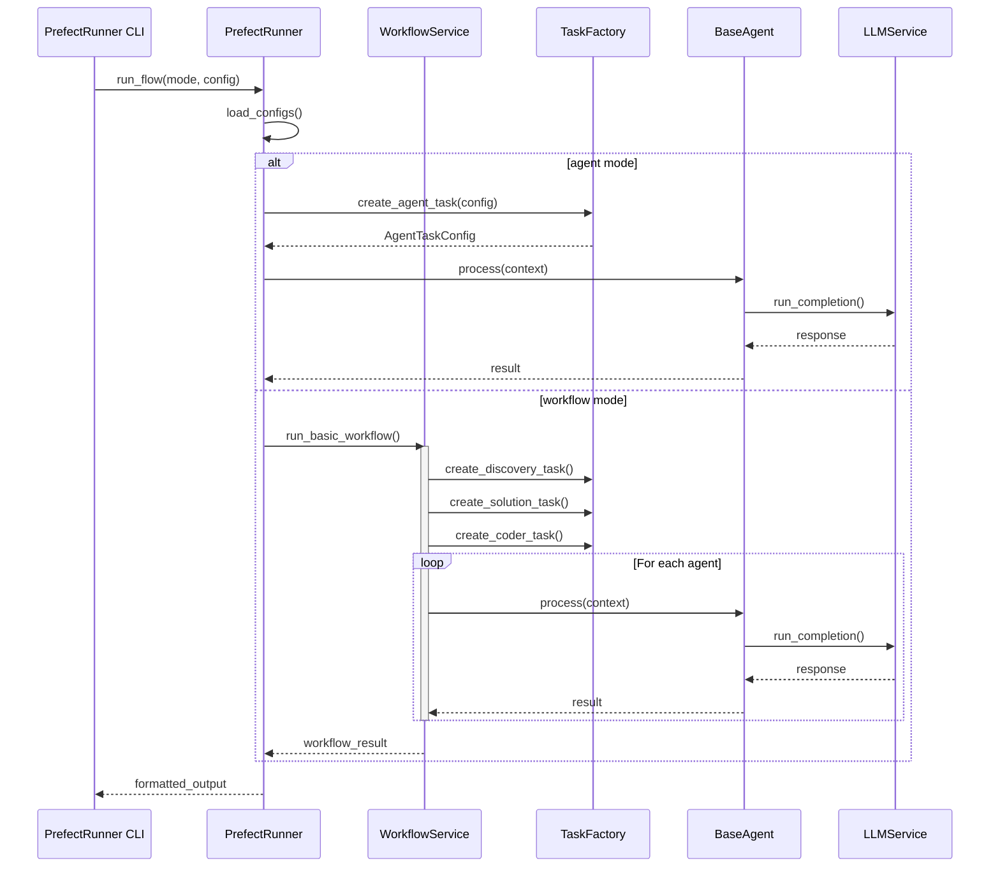
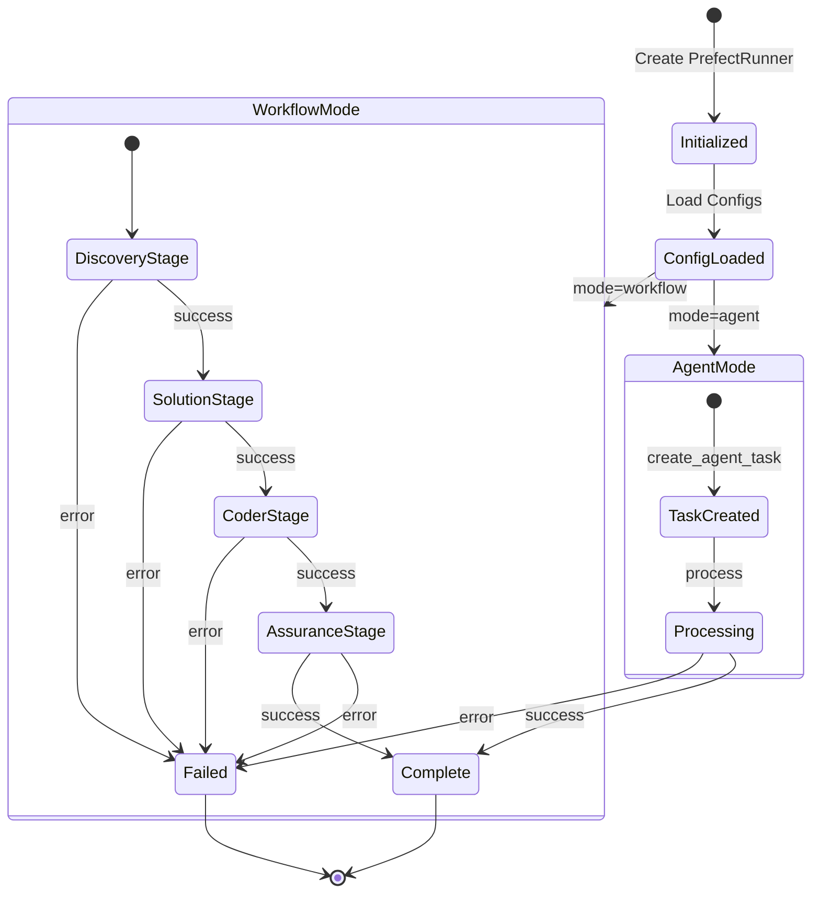
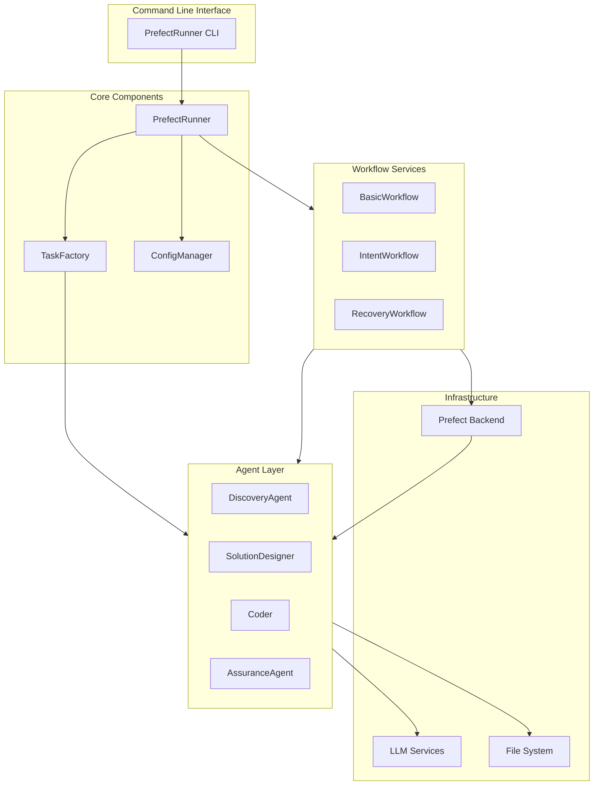

# Prefect Runner Architecture Documentation

## Overview
This document provides a comprehensive view of the Prefect Runner architecture through various UML and architectural diagrams.

## Class Diagram
The class diagram shows the core classes and their relationships in the system.

## Sequence Diagram
The sequence diagram illustrates the interaction flow between components during execution.

## State Diagram
The state diagram shows the possible states and transitions of the system.

## Architecture Diagram
The architecture diagram provides a high-level view of the system components and their organization.

## Key Architectural Principles

1. **Single Responsibility**: Each component has a well-defined and specific role
   - PrefectRunner handles orchestration
   - TaskFactory manages agent creation
   - Agents perform specific tasks
   - WorkflowService manages workflow execution

2. **Open/Closed**: The system is designed for extension
   - New agents can be added without modifying existing code
   - New workflows can be created using existing components
   - Factory pattern allows for new agent types

3. **Dependency Injection**
   - Configuration is injected into components
   - Agent dependencies are managed through AgentTaskConfig
   - Services are loosely coupled through interfaces

4. **Interface Segregation**
   - Clean separation between CLI, runner, and agents
   - Well-defined interfaces between components
   - Minimal dependencies between layers

5. **Separation of Concerns**
   - Clear separation of responsibilities
   - Modular design with distinct layers
   - Independent scaling of components