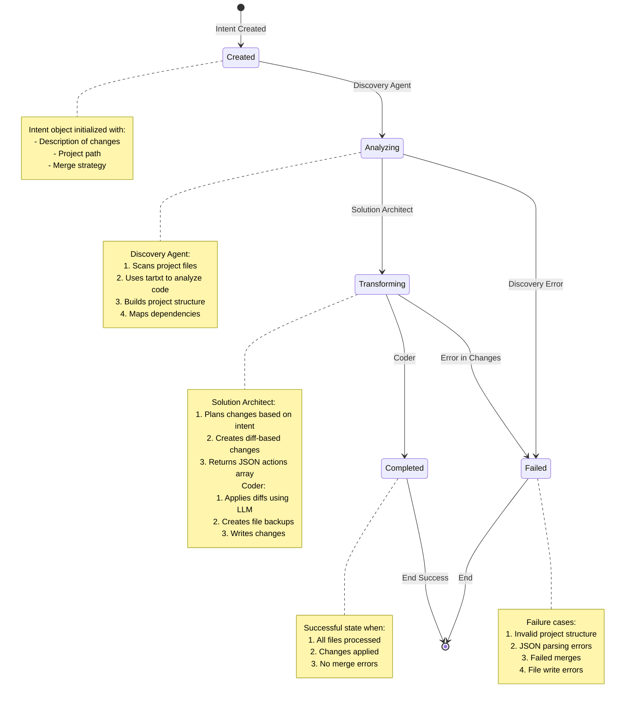
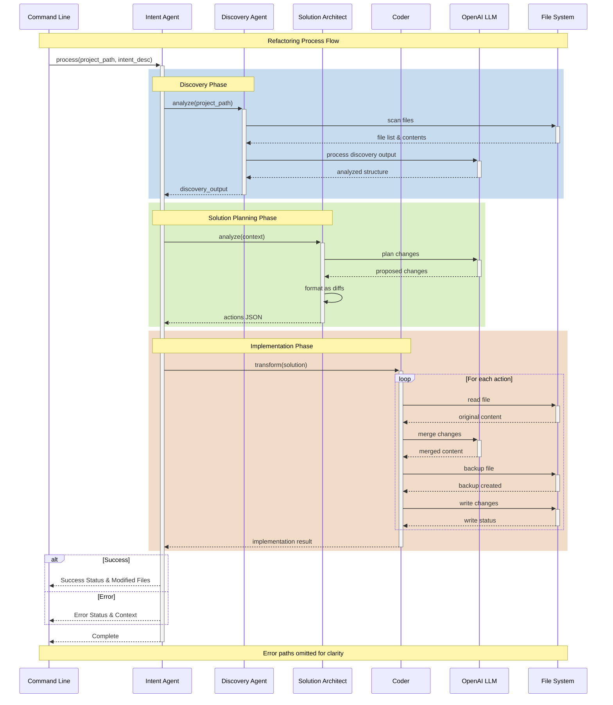
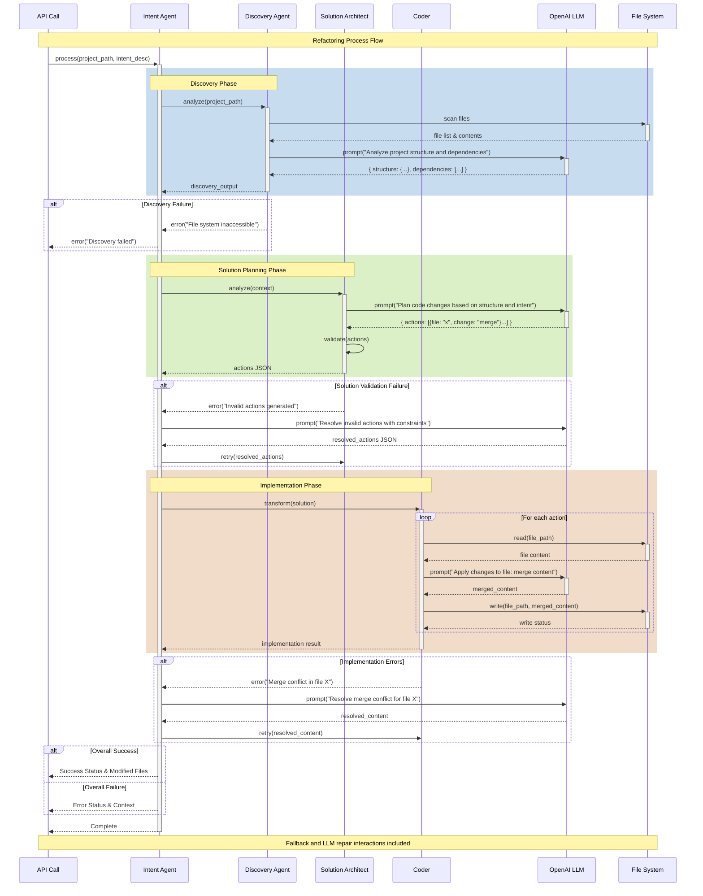

Over arching Goals

As long as the minimum structure is met, allow the llm to resolve the errors

i want the interactions to be more emergent and interactive, 
each agent knows what it needs to do, it specialises in its task, discovery passes, intent + scope, 

solutino doesnt need to spend too much time validating the inpput, thats up to the remote llm to interpret, 
its job is to manage the specific prompts and itneractions with the llm to provide a solution over the scope that fulfills the intent
Currently - we want the solution to be a series of Merges or File creations (e.g. a merge over a non existent file)
In the future the prompt may include other skills such install packages, or initialise a database etc.
When the llm responds, based upon the structure instructions of the Solution Agent, it passes it on to the coder.

The code takes the Actions from the Solution Agent, which should be a series of merges of merges over files, existing or not existing
It uses the LLM to execute a specific code merge action
It then write the updated file out

Ultimately it passes to the assurance agent to do its thing

I'll create a sequence diagram showing the detailed interactions between the Intent Agent and other components.

Key interaction points:

1. **Initial Setup**
   - CLI initiates process with project path and intent description
   - Intent Agent coordinates all phases

2. **Discovery Phase (Blue)**
   - Discovery Agent scans filesystem
   - Uses tartxt for code analysis
   - LLM processes and structures discovery output

3. **Solution Planning (Green)**
   - Solution Architect takes discovery output
   - LLM plans changes based on intent
   - Returns JSON structure with diff-based actions

4. **Implementation Phase (Red)**
   - Coder handles each action sequentially
   - For each file:
     1. Reads original content
     2. Uses LLM to merge changes
     3. Creates backup
     4. Writes changes
   - Returns aggregated results

5. **Result Handling**
   - Success: Returns modified files list
   - Error: Returns error context
   - Both include full execution context

Key aspects not shown in diagram for clarity:
1. Error handling paths
2. Retry logic
3. Validation steps
4. Autogen interaction details
5. Logging operations

Would you like me to:
1. Add error handling paths?
2. Show more detail about the LLM interactions?
3. Include the validation steps?
4. Show the specific message formats?

