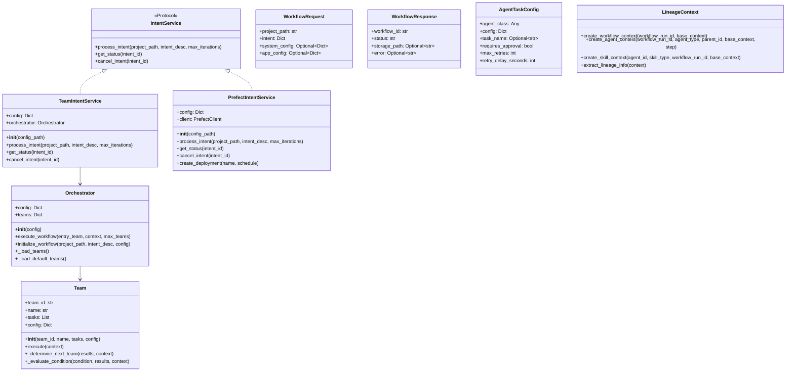
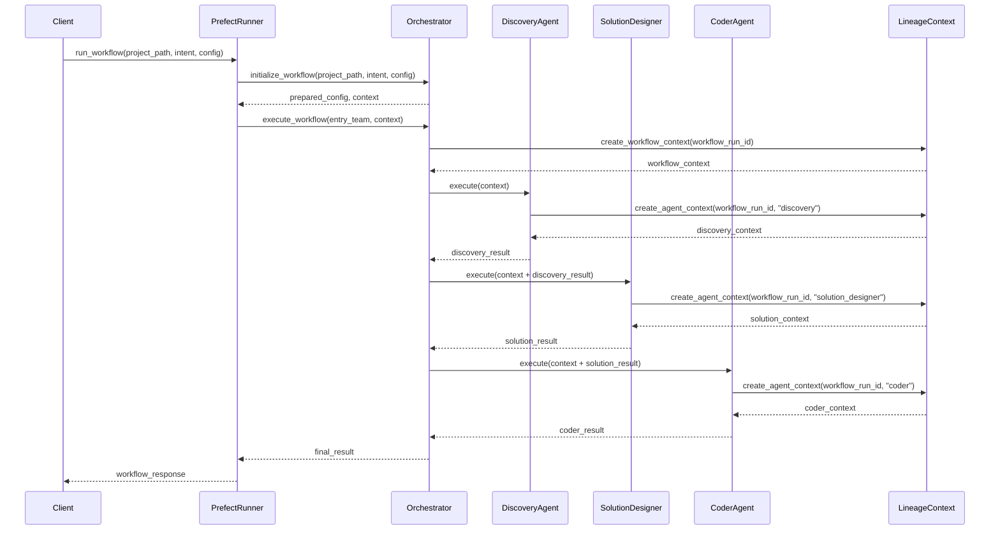
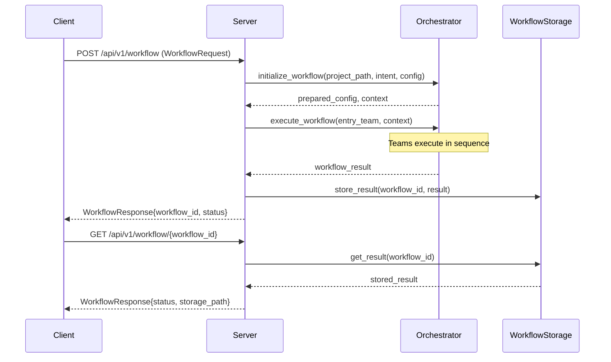

# c4h_services API Reference

## Introduction

The `c4h_services` library serves as a service orchestration layer that implements and exposes the core functionality provided by `c4h_agents`. It provides various implementations of the intent service interface, adds workflow orchestration, offers a REST API, and includes utilities for configuration management and logging. The primary purpose of this library is to:

1. Provide service-level implementations for agent orchestration
2. Support multiple execution modes (local, prefect-based workflows, client mode)
3. Expose agent functionality through a RESTful API
4. Manage teams of agents working together
5. Handle workflow execution, monitoring, and lineage tracking

The library acts as the integration layer between the agent system and external interfaces, ensuring proper configuration propagation, execution tracking, and error handling.

## Folder Structure

```
c4h_services/
├── src/
│   ├── bootstrap/
│   │   └── prefect_runner.py    # Main entry point for execution
│   ├── api/
│   │   ├── service.py           # FastAPI service implementation
│   │   └── models.py            # API request/response models
│   ├── intent/
│   │   ├── core/
│   │   │   └── service.py       # Intent service interface
│   │   └── impl/
│   │       ├── team/
│   │       │   └── service.py   # Team-based implementation
│   │       └── prefect/
│   │           ├── service.py   # Prefect implementation
│   │           ├── flows.py     # Workflow definitions
│   │           ├── tasks.py     # Task wrappers
│   │           ├── models.py    # Task models
│   │           ├── factories.py # Task factories
│   │           └── workflows.py # Core workflow logic
│   ├── orchestration/
│   │   ├── orchestrator.py      # Team orchestration
│   │   └── team.py              # Team implementation
│   └── utils/
│       ├── logging.py           # Logging utilities
│       ├── string_utils.py      # String handling utilities
│       └── __init__.py          # Package exports
```

## Class Diagram



## Sequence Diagram

### Workflow Execution Sequence



### Client-Server Interaction Sequence



## Main Entry Point: prefect_runner.py

The `prefect_runner.py` script serves as the main entry point for the services implementation, providing command-line and API interfaces to the agent system.

```python
class prefect_runner:
    # Main entry point function
    def main()
    
    # Configuration loading
    def load_configs(app_config_path: Optional[str] = None, system_config_paths: Optional[List[str]] = None) -> Dict[str, Any]
    
    # Workflow execution
    def run_workflow(project_path: Optional[str], intent_desc: Dict[str, Any], config: Dict[str, Any]) -> Dict[str, Any]
    
    # Client mode helpers
    def send_workflow_request(host: str, port: int, project_path: str, intent_desc: Dict[str, Any], 
                              app_config: Optional[Dict[str, Any]] = None,
                              system_config: Optional[Dict[str, Any]] = None) -> Dict[str, Any]
    
    def get_workflow_status(host: str, port: int, workflow_id: str) -> Dict[str, Any]
    
    def poll_workflow_status(host: str, port: int, workflow_id: str, 
                            poll_interval: int = 5, max_polls: int = 60) -> Dict[str, Any]
```

### Usage Modes

The runner supports three primary modes:

1. **Workflow Mode**: Direct execution of agent workflows
   ```bash
   python -m c4h_services.src.bootstrap.prefect_runner workflow --project-path /path/to/project --intent-file intent.json
   ```

2. **Service Mode**: Running as a REST API service
   ```bash
   python -m c4h_services.src.bootstrap.prefect_runner service --port 8000 --config config.yml
   ```

3. **Client Mode**: Communicating with a running service
   ```bash
   python -m c4h_services.src.bootstrap.prefect_runner client --host localhost --port 8000 --project-path /path/to/project --intent-file intent.json --poll
   ```

### Configuration Loading

```python
# Load and merge configurations from multiple sources
config = load_configs(
    app_config_path="app_config.yml",
    system_config_paths=["system_config.yml", "override_config.yml"]
)
```

## Core Services Implementation

### IntentService Protocol (intent/core/service.py)

```python
@runtime_checkable
class IntentService(Protocol):
    # Process a refactoring intent
    def process_intent(
        self,
        project_path: Path,
        intent_desc: Dict[str, Any],
        max_iterations: int = 3
    ) -> Dict[str, Any]
    
    # Get status for a workflow run
    def get_status(self, intent_id: str) -> Dict[str, Any]
    
    # Cancel a running workflow
    def cancel_intent(self, intent_id: str) -> bool
```

### TeamIntentService (intent/impl/team/service.py)

```python
class TeamIntentService(IntentService):
    # Initialization
    def __init__(self, config_path: Optional[Path] = None)
    
    # Process refactoring intent through team workflow
    async def process_intent(
        self,
        project_path: Path,
        intent_desc: Dict[str, Any],
        max_iterations: int = 3
    ) -> Dict[str, Any]
    
    # Get status for a workflow run
    async def get_status(self, intent_id: str) -> Dict[str, Any]
    
    # Cancel a workflow run
    async def cancel_intent(self, intent_id: str) -> bool
```

### PrefectIntentService (intent/impl/prefect/service.py)

```python
class PrefectIntentService:
    # Initialization
    def __init__(self, config_path: Optional[Path] = None)
    
    # Process refactoring intent through Prefect workflow
    async def process_intent(
        self,
        project_path: Path,
        intent_desc: Dict[str, Any],
        max_iterations: int = 3
    ) -> Dict[str, Any]
    
    # Get status from Prefect flow run
    async def get_status(self, intent_id: str) -> Dict[str, Any]
    
    # Cancel Prefect flow run
    async def cancel_intent(self, intent_id: str) -> bool
    
    # Create a deployment for the intent workflow
    async def create_deployment(
        self,
        name: str,
        schedule: Optional[str] = None
    ) -> Dict[str, Any]
```

## Orchestration

### Team-Based Architecture

In the C4H architecture, a team represents a workflow with its associated agents. The current implementation includes a single "Engineering Development Team" that consists of multiple agents working in sequence:

1. Discovery Agent - Analyzes project structure
2. Solution Designer Agent - Designs code changes
3. Coder Agent - Implements the changes

This architecture is designed to be extensible, allowing for future implementations with multiple specialized teams or sub-teams (e.g., a dedicated Discovery Team with multiple specialized discovery agents).

### Orchestrator (orchestration/orchestrator.py)

```python
class Orchestrator:
    # Initialization
    def __init__(self, config: Dict[str, Any])
    
    # Initialize workflow configuration with consistent defaults
    def initialize_workflow(
        self,
        project_path: Union[str, Path],
        intent_desc: Dict[str, Any],
        config: Dict[str, Any]
    ) -> Tuple[Dict[str, Any], Dict[str, Any]]
    
    # Load team configurations
    def _load_teams(self) -> None
    
    # Load default teams for backward compatibility
    def _load_default_teams(self) -> None
    
    # Execute a workflow starting from the specified team
    def execute_workflow(
        self, 
        entry_team: str = "discovery",
        context: Dict[str, Any] = None,
        max_teams: int = 10
    ) -> Dict[str, Any]
```

### Team (orchestration/team.py)

```python
class Team:
    # Initialization
    def __init__(self, team_id: str, name: str, tasks: List[AgentTaskConfig], config: Dict[str, Any])
    
    # Execute this agent's tasks in sequence
    def execute(self, context: Dict[str, Any]) -> Dict[str, Any]
    
    # Determine the next agent to execute based on routing rules and results
    def _determine_next_team(self, results: List[Dict[str, Any]], context: Dict[str, Any]) -> Optional[str]
    
    # Evaluate a routing condition against results and context
    def _evaluate_condition(self, condition: str, results: List[Dict[str, Any]], context: Dict[str, Any]) -> bool
```

## Prefect Implementation

### AgentTaskConfig (intent/impl/prefect/models.py)

```python
class AgentTaskConfig(BaseModel):
    # Agent class or string path for dynamic loading
    agent_class: Any
    
    # Configuration dictionary
    config: Dict[str, Any] = Field(default_factory=dict)
    
    # Task name
    task_name: Optional[str] = None
    
    # Whether this task requires user approval
    requires_approval: bool = Field(default=False)
    
    # Max retry attempts
    max_retries: int = Field(default=3)
    
    # Seconds to wait between retries
    retry_delay_seconds: int = Field(default=30)
    
    class Config:
        arbitrary_types_allowed = True
```

### run_agent_task (intent/impl/prefect/tasks.py)

```python
@task(retries=2, retry_delay_seconds=10)
def run_agent_task(
    agent_config: AgentTaskConfig,
    context: Dict[str, Any],
    task_name: Optional[str] = None
) -> Dict[str, Any]
```

### Task Factories (intent/impl/prefect/factories.py)

```python
# Prepare configuration for an agent
def prepare_agent_config(config: Dict[str, Any], agent_section: str) -> Dict[str, Any]

# Create discovery agent task configuration
def create_discovery_task(config: Dict[str, Any]) -> AgentTaskConfig

# Create solution designer task configuration
def create_solution_task(config: Dict[str, Any]) -> AgentTaskConfig

# Create coder agent task configuration
def create_coder_task(config: Dict[str, Any]) -> AgentTaskConfig

# Create assurance task configuration
def create_assurance_task(config: Dict[str, Any]) -> AgentTaskConfig

# Create task configurations for a team from configuration
def create_team_tasks(config: Dict[str, Any], team_config: Dict[str, Any]) -> List[AgentTaskConfig]
```

### Workflows (intent/impl/prefect/workflows.py)

```python
# Prepare workflow configuration with proper run ID and context
def prepare_workflow_config(base_config: Dict[str, Any]) -> Dict[str, Any]

# Basic workflow implementing the core refactoring steps
@flow(name="basic_refactoring")
def run_basic_workflow(
    project_path: Path,
    intent_desc: Dict[str, Any],
    config: Dict[str, Any]
) -> Dict[str, Any]
```

### Flows (intent/impl/prefect/flows.py)

```python
# Main workflow for intent-based refactoring
@flow(name="intent_refactoring")
def run_intent_workflow(
    project_path: Path,
    intent_desc: Dict[str, Any],
    config: Dict[str, Any],
    max_iterations: int = 3
) -> Dict[str, Any]

# Recovery workflow for handling failed runs
@flow(name="intent_recovery")
def run_recovery_workflow(
    flow_run_id: str,
    config: Dict[str, Any]
) -> Dict[str, Any]

# Rollback workflow for undoing changes
@flow(name="intent_rollback")
def run_rollback_workflow(
    flow_run_id: str,
    config: Dict[str, Any]
) -> Dict[str, Any]
```

## API Service

### API Models (api/models.py)

```python
class WorkflowRequest(BaseModel):
    # Path to the project to be processed
    project_path: str = Field(..., description="Path to the project to be processed")
    
    # Intent description for the workflow
    intent: Dict[str, Any] = Field(..., description="Intent description for the workflow")
    
    # Base system configuration
    system_config: Optional[Dict[str, Any]] = Field(default=None, description="Base system configuration")
    
    # Application-specific configuration overrides
    app_config: Optional[Dict[str, Any]] = Field(default=None, description="Application-specific configuration overrides")

class WorkflowResponse(BaseModel):
    # Unique identifier for the workflow
    workflow_id: str = Field(..., description="Unique identifier for the workflow")
    
    # Current status of the workflow
    status: str = Field(..., description="Current status of the workflow")
    
    # Path to stored results if available
    storage_path: Optional[str] = Field(default=None, description="Path to stored results if available")
    
    # Error message if status is 'error'
    error: Optional[str] = Field(default=None, description="Error message if status is 'error'")
```

### FastAPI Service (api/service.py)

```python
def create_app(default_config: Dict[str, Any] = None) -> FastAPI:
    # Create FastAPI application with team-based orchestration
    
    @app.post("/api/v1/workflow", response_model=WorkflowResponse)
    async def run_workflow(request: WorkflowRequest):
        # Execute a team-based workflow with the provided configuration
        
    @app.get("/api/v1/workflow/{workflow_id}", response_model=WorkflowResponse)
    async def get_workflow(workflow_id: str):
        # Get workflow status and results
        
    @app.get("/health")
    async def health_check():
        # Simple health check endpoint
```

## Agent Design Principles

### Overarching Principles

1. **LLM-First Processing**
   - Offload most logic and decision-making to the LLM
   - Use LLM for verification and validation where possible
   - Agents focus on:
     - Managing intent prompts
     - Processing responses
     - Managing local environment side effects

2. **Minimal Agent Logic**
   - Keep agent code focused on infrastructure concerns
   - Avoid embedding business logic in agents
   - Let LLM handle complex decision trees

### Implementation Principles

1. **Single Responsibility**
   - Each agent has one clear, focused task
   - No processing of tasks that belong to other agents
   - Pass through data without unnecessary interpretation
   - Example: Discovery agent handles only file analysis, Solution Designer only creates prompts

2. **Minimal Processing**
   - Default to passing data through to LLM
   - Only transform data if it's core to the agent's infrastructure role
   - Don't duplicate validation or processing done by other agents
   - Let LLM handle data interpretation where possible

3. **Clear Boundaries**
   - Discovery agent handles file analysis and scoping
   - Solution Designer creates optimal prompts
   - Semantic Iterator handles response parsing and iteration
   - Each agent trusts other agents' output
   - No cross-agent validation

4. **Logging Over Validation**
   - Focus on detailed logging for debugging
   - Let calling agents handle validation
   - Log key events, inputs, and outputs
   - Make agent behavior observable
   - Reserve validation for infrastructure concerns only

5. **Error Handling**
   - Handle only errors specific to infrastructure tasks
   - Pass through errors from external services (like LLM)
   - Provide clear error context in logs
   - Don't swallow or transform errors unnecessarily
   - Let LLM handle business logic errors

6. **Stateless Operation**
   - Agents don't maintain state between operations
   - Each request is self-contained
   - State management happens at orchestration level
   - Makes testing and debugging simpler

7. **Composability**
   - Agents can be chained together
   - Output format matches input format of next agent
   - No hidden dependencies between agents
   - Clean interfaces between agents

8. **Observable Behavior**
   - Extensive structured logging
   - Clear input/output contracts
   - Traceable request/response flow
   - Debuggable operation

9. **Focused Testing**
   - Test only the agent's infrastructure responsibility
   - Don't test downstream agent behavior
   - Mock external services appropriately
   - Test logging and error handling
   - Don't test LLM decision logic

10. **Forward-Only Flow**
    - Data flows forward through agent chain
    - No backward dependencies
    - Each agent adds its specific value
    - Clean sequential processing

## Configuration Design Principles

### Overarching Principles

1. **Hierarchical Configuration**
   - All configuration follows a strict hierarchy
   - Base config provides defaults and templates
   - Override config adds or updates leaf nodes
   - Preserve structure during merges
   - Config paths follow consistent patterns (e.g., llm_config.agents.[name])

2. **Smart Merge Behavior**
   - Base config provides foundation
   - Override config can add new nodes
   - Override config can update leaf values
   - Preserve parent node structure
   - Don't break existing config paths

3. **Separation of Responsibilities**
   - config.py owns configuration management
   - BaseAgent provides config access methods
   - Each agent responsible for its own config section
   - No cross-agent config dependencies
   - Config handling isolated from business logic

### Implementation Principles

1. **Config Location**
   - Clear hierarchical paths (e.g., llm_config.agents.[name])
   - Consistent lookup patterns
   - Fail gracefully with empty dict if not found
   - Log lookup attempts and results
   - Support project-based config overrides

2. **Config Access**
   - Agents access only their own config section
   - Use BaseAgent methods for config retrieval
   - Get agent name for lookups
   - Handle missing config gracefully
   - Log config access patterns

3. **Config Processing**
   - Process config at initialization
   - Cache needed values
   - Minimal runtime config lookups
   - Log config state changes
   - Handle config errors gracefully

4. **Config Validation**
   - Basic structure validation in config.py
   - Type validation where critical
   - Log validation failures
   - Fail fast on critical config missing
   - Allow flexible extension

5. **Config Resilience**
   - Handle missing config as critical failure
   - Defaults only come from configuration hence merging behavior
   - Log configuration issues
   - Support runtime updates
   - Maintain backward compatibility

## System Configuration Structure

The system configuration (system_config.yml) provides a comprehensive configuration template for the entire agent system. It serves as the foundation that can be extended or overridden by application-specific configurations.

### Purpose

1. Provide default configurations for all components
2. Define provider settings (API endpoints, models, etc.)
3. Configure agent-specific parameters
4. Set up team composition and routing
5. Define workflow and lineage tracking settings
6. Configure logging and backup behavior

### Configuration Structure

```yaml
llm_config:
  # Provider configurations
  providers:
    anthropic:
      api_base: "https://api.anthropic.com"
      context_length: 200000
      env_var: "ANTHROPIC_API_KEY"
      default_model: "claude-3-5-sonnet-20241022"
      valid_models: [...]
      extended_thinking:
        enabled: false
        budget_tokens: 32000
        min_budget_tokens: 1024
        max_budget_tokens: 128000
      litellm_params:
        retry: true
        max_retries: 5
        timeout: 30
        
    openai:
      api_base: "https://api.openai.com/v1"
      env_var: "OPENAI_API_KEY"
      default_model: "gpt-4o"
      valid_models: [...]

    gemini:
      api_base: "https://generativelanguage.googleapis.com/v1beta"
      context_length: 32000
      env_var: "GEMINI_API_KEY"
      default_model: "gemini-2"
      valid_models: [...]

  # Global defaults
  default_provider: "anthropic"
  default_model: "claude-3-opus-20240229"
  
  # Agent-specific configurations
  agents:
    base:  # Base settings all agents inherit
      storage:
        root_dir: "workspaces"
        
    lineage:  # Lineage tracking configuration
      enabled: true
      namespace: "c4h_agents"
      backend:
        type: "file"
        
    discovery:
      default_provider: "anthropic"
      default_model: "claude-3-5-sonnet-20241022"
      temperature: 0
      tartxt_config: {...}
      prompts: {...}
      
    solution_designer:
      provider: "anthropic"
      model: "claude-3-5-sonnet-20241022"
      temperature: 0
      prompts: {...}
      
    semantic_extract:
      provider: "anthropic"
      model: "claude-3-opus-20240229"
      temperature: 0
      prompts: {...}
      
    semantic_iterator:
      prompts: {...}
      
    semantic_fast_extractor:
      provider: "openai"
      model: "o3-mini" 
      temperature: 0
      prompts: {...}
      
    semantic_slow_extractor:
      provider: "openai"
      model: "o3-mini"  
      temperature: 0
      prompts: {...}
      
    semantic_merge:
      provider: "openai"
      model: "o3-mini"  
      temperature: 0
      merge_config: {...}
      prompts: {...}
      
    coder:
      provider: "anthropic"
      model: "claude-3-opus-20240229"
      temperature: 0
      prompts: {...}
    
    assurance:
      provider: "openai"
      model: "gpt-4-0125-preview"
      temperature: 0
      prompts: {...}

# Team orchestration configuration
orchestration:
  enabled: true
  entry_team: "discovery"  # First agent to execute in the workflow
  error_handling:
    retry_teams: true
    max_retries: 2
    log_level: "ERROR"
  teams:
    # These are agents in the engineering team workflow, not separate teams
    # Each "team" entry here represents an agent in the workflow sequence
    discovery:
      name: "Discovery Agent"
      tasks:
        - name: "discovery"
          agent_class: "c4h_agents.agents.discovery.DiscoveryAgent"
          requires_approval: false
          max_retries: 2
      routing:
        default: "solution"  # Go to solution agent next
    
    solution:
      name: "Solution Design Agent"
      tasks:
        - name: "solution_designer"
          agent_class: "c4h_agents.agents.solution_designer.SolutionDesigner"
          requires_approval: true
          max_retries: 1
      routing:
        rules:
          - condition: "all_success"
            next_team: "coder"
          - condition: "any_failure"
            next_team: "fallback"
        default: "coder"  # Default next agent
    
    coder:
      name: "Coder Agent"
      tasks:
        - name: "coder"
          agent_class: "c4h_agents.agents.coder.Coder"
          requires_approval: true
          max_retries: 1
      routing:
        rules:
          - condition: "all_success"
            next_team: null  # End workflow on success
        default: null  # End workflow by default
    
    # Fallback agent - handles failures with simplified approach
    fallback:
      name: "Fallback Agent"
      tasks:
        - name: "fallback_coder"
          agent_class: "c4h_agents.agents.coder.Coder"
          config:
            temperature: 0  # Lower temperature for more conservative changes
      routing:
        default: null  # End workflow after fallback

# Runtime configuration for workflow and lineage
runtime:
  # Workflow storage configuration
  workflow:
    storage:
      enabled: true
      root_dir: "workspaces/workflows"
      format: "yymmdd_hhmm_{workflow_id}"
      retention:
        max_runs: 10
        max_days: 30
      error_handling:
        ignore_storage_errors: true
        log_level: "ERROR"
  # Lineage tracking configuration
  lineage:
    enabled: true
    namespace: "c4h_agents"
    separate_input_output: true
    backend:
      type: "file"  # File-based storage is more reliable for initial testing
      path: "workspaces/lineage"  # Use explicit relative path
    error_handling:
      ignore_failures: true  # Don't let lineage errors affect workflow
      log_level: "ERROR"
    context:
      include_metrics: true
      include_token_usage: true
      record_timestamps: true
    retry:
      enabled: true
      max_attempts: 3
      initial_delay: 1
      max_delay: 30
      backoff_factor: 2
      retry_on:
        - "overloaded_error"
        - "rate_limit_error"
        - "timeout_error"

# Backup settings
backup:
  enabled: true
  path: "workspaces/backups"  # Default backup path

logging:
  level: "INFO"
  format: "structured"
  agent_level: "INFO"
  providers:
    anthropic:
      level: "debug"
    openai:
      level: "debug"
  truncate:
    prefix_length: 30
    suffix_length: 30
```

## Usage Patterns

### Running as a Service

```python
from c4h_services.src.bootstrap.prefect_runner import create_app
from c4h_services.src.bootstrap.prefect_runner import load_configs

# Load configuration
config = load_configs("app_config.yml", ["system_config.yml"])

# Create FastAPI app
app = create_app(default_config=config)

# Run the service
import uvicorn
uvicorn.run(app, host="0.0.0.0", port=8000)
```

### Running a Direct Workflow

```python
from c4h_services.src.bootstrap.prefect_runner import run_workflow
from c4h_services.src.bootstrap.prefect_runner import load_configs
from pathlib import Path

# Load configuration
config = load_configs("app_config.yml", ["system_config.yml"])

# Define intent
intent = {
    "description": "Refactor code to follow single responsibility principle",
    "target_files": ["src/module.py", "src/utils.py"]
}

# Run workflow
result = run_workflow(
    project_path=Path("/path/to/project"),
    intent_desc=intent,
    config=config
)

# Process result
if result["status"] == "success":
    print(f"Changes applied: {len(result['changes'])}")
    for change in result.get("changes", []):
        print(f"- {change['file']}: {change['success']}")
else:
    print(f"Error: {result['error']}")
```

### Using Client Mode

```python
from c4h_services.src.bootstrap.prefect_runner import send_workflow_request, poll_workflow_status

# Define client parameters
host = "localhost"
port = 8000
project_path = "/path/to/project"
intent = {
    "description": "Add error handling to all public methods",
    "target_files": ["src/module.py"]
}

# Send request to server
result = send_workflow_request(
    host=host,
    port=port,
    project_path=project_path,
    intent_desc=intent
)

# Get workflow ID
workflow_id = result["workflow_id"]

# Poll for completion
final_status = poll_workflow_status(
    host=host,
    port=port,
    workflow_id=workflow_id,
    poll_interval=5,
    max_polls=60
)

print(f"Final status: {final_status['status']}")
```

### Using the Team Orchestrator

```python
from c4h_services.src.orchestration.orchestrator import Orchestrator

# Create orchestrator with configuration
orchestrator = Orchestrator(config)

# First, initialize the workflow
prepared_config, context = orchestrator.initialize_workflow(
    project_path="/path/to/project",
    intent_desc={
        "description": "Add error handling to function X"
    },
    config=config
)

# Execute workflow with the prepared context
result = orchestrator.execute_workflow(
    entry_team="discovery",
    context=context,
    max_teams=10
)

# Process result
print(f"Status: {result['status']}")
print(f"Execution path: {' -> '.join(result['execution_path'])}")
```

### Using the API

```python
import requests
import json

# API endpoint
url = "http://localhost:8000/api/v1/workflow"

# Request data
data = {
    "project_path": "/path/to/project",
    "intent": {
        "description": "Refactor code to improve error handling",
        "target_files": ["src/module.py"]
    },
    "system_config": None,
    "app_config": {
        "logging": {
            "level": "DEBUG"
        }
    }
}

# Send request
response = requests.post(url, json=data)
result = response.json()

# Get workflow ID
workflow_id = result["workflow_id"]

# Check status
status_url = f"http://localhost:8000/api/v1/workflow/{workflow_id}"
status = requests.get(status_url).json()

print(f"Status: {status['status']}")
print(f"Storage Path: {status['storage_path']}")
```

## Response Formats

### Workflow Response

```python
{
    "workflow_id": "wf_12345",
    "status": "success",
    "storage_path": "workspaces/lineage/wf_12345",
    "error": None
}
```

### Detailed Workflow Result

```python
{
    "status": "success",
    "workflow_run_id": "wf_12345",
    "execution_path": ["discovery", "solution", "coder"],
    "team_results": {
        "discovery": {
            "success": True,
            "data": {...},
            "next_team": "solution"
        },
        "solution": {
            "success": True,
            "data": {...},
            "next_team": "coder"
        },
        "coder": {
            "success": True,
            "data": {...},
            "next_team": None
        }
    },
    "data": {
        "changes": [
            {
                "file": "src/module.py",
                "success": True,
                "error": None,
                "backup": "workspaces/backups/20240307_123456/src/module.py"
            }
        ]
    },
    "teams_executed": 3,
    "timestamp": "2024-03-07T12:34:56Z",
    "execution_metadata": {
        "workflow_run_id": "wf_12345",
        "step_sequence": 3,
        "agent_sequence": [
            {"agent": "discovery", "id": "agent_id_1", "step": 1},
            {"agent": "solution_designer", "id": "agent_id_2", "step": 2},
            {"agent": "coder", "id": "agent_id_3", "step": 3}
        ]
    }
}
```

### Team Orchestrator

The current implementation uses what appears to be a "team"-based structure in the configuration, but it's important to note that these are actually agents within a single engineering workflow. The team structure is designed to be future-proof, allowing for true team-based organization in later versions.

1. **Current Implementation**: All agents (Discovery, Solution Designer, Coder) are part of a single workflow sequence, with the "teams" configuration actually referring to agent stages within this workflow.

2. **Future Extensibility**: The architecture is designed to eventually support true teams with sub-teams and specialized agent groups working in concert.

The current terminology in the codebase refers to these agent stages as "teams" for backward compatibility and future extensibility, but conceptually they are sequential stages in a single engineering workflow.

## Key Design Principles

1. **Team-Based Execution**: Organize agents into teams with clear responsibilities
2. **Workflow Orchestration**: Sequential team execution with conditional routing
3. **Configuration Hierarchy**: System config + application overrides
4. **Service Independence**: Multiple service implementations with same interface
5. **Lineage Tracking**: Record execution paths and relationships
6. **Error Resilience**: Graceful fallback and recovery mechanisms
7. **Observability**: Comprehensive logging and monitoring

These principles ensure that the service layer can effectively coordinate agent activities while maintaining flexibility, reliability, and observability.

## Command-Line Interface (CLI) Options

The `prefect_runner.py` script provides a comprehensive command-line interface with the following options:

```
usage: prefect_runner.py [-h] [-P PORT] [--config CONFIG] [--system-configs SYSTEM_CONFIGS [SYSTEM_CONFIGS ...]]
                         [--project-path PROJECT_PATH] [--intent-file INTENT_FILE] [--host HOST] [--poll]
                         [--poll-interval POLL_INTERVAL] [--max-polls MAX_POLLS] [--log {debug,normal}]
                         [{workflow,service,client}]

Streamlined team-based workflow runner and API service

positional arguments:
  {workflow,service,client}
                        Run mode (workflow, service, or client)

options:
  -h, --help            show this help message and exit
  -P PORT, --port PORT  Port number for API service mode or client communication
  --config CONFIG       Path to application config file
  --system-configs SYSTEM_CONFIGS [SYSTEM_CONFIGS ...]
                        Optional system config files in merge order
  --project-path PROJECT_PATH
                        Path to the project (optional if defined in config)
  --intent-file INTENT_FILE
                        Path to intent JSON file (optional if intent defined in config)
  --host HOST           Host for client mode
  --poll                Poll for workflow completion in client mode
  --poll-interval POLL_INTERVAL
                        Seconds between status checks in client mode
  --max-polls MAX_POLLS
                        Maximum number of status checks in client mode
  --log {debug,normal}  Logging level
```